# 生成器模式（Builder）

## 意图

将一个复杂对象的构建与它的表示分离，使得同样的构建过程可以创建不同的表示。

## 适用性

* **创建复杂对象的算法**应该独立于**对象的组成部分**以及**装配方式**时。

* 构造过程必须允许被构造对象**有不同表示**。

## 结构



## 参与者

1. **Builder**

为组成产品的各个组件指定接口。

```java
/**
 * 抽象建造者 -> 电脑Builder
 *
 * @author Jinhua
 * @date 2021/3/2下午10:30
 */
public abstract class AbstractComputerBuilder {

    /**
     * 待构建的复杂对象 -> 电脑
     */
    @Getter
    protected Computer computer;

    /**
     * 构建主机
     */
    public abstract void buildMaster();

    /**
     * 构建显示器
     */
    public abstract void buildScreen();

    /**
     * 构建键盘
     */
    public abstract void buildKeyboard();

    /**
     * 构建鼠标
     */
    public abstract void buildMouse();

    @SneakyThrows
    @Override
    public String toString() {
        return new ObjectMapper().writeValueAsString(this);
    }
}
```

2. **ConcreteBuilder**

* 实现接口，完成**部件的构造**；
* 定义并跟踪它所创建的表示。
* 获取**组装后的产品**接口方法。

```java
/**
 * 具体构建者 -> 电脑构建者<p>
 * 目前用一个实现
 *
 * @author Jinhua
 * @date 2021/3/2下午10:49
 */
public class ConcreteComputerBuilder extends AbstractComputerBuilder {

    public ConcreteComputerBuilder() {
        super();
        super.computer = new Computer();
    }

    @Override
    public void buildMaster() {
        super.computer.setMaster(new Master("linux 服务主机", new AppleCpu(), new AmdGraphicsCard()));
    }

    @Override
    public void buildScreen() {
        super.computer.setScreen(new Screen());
    }

    @Override
    public void buildKeyboard() {
        super.computer.setKeyboard(new Keyboard());
    }

    @Override
    public void buildMouse() {
        super.computer.setMouse(new Mouse());
    }
}
```

3. **Director**

* **隔离**了客户和创建过程；
* **控制创建过程**。

```java
/**
 * 指导创建者<p>
 * 个人基于URIBuilder理解：如果所指挥的逻辑不复杂，可优化为Builder类的一个方法
 *
 * @author Jinhua
 * @date 2021/3/2下午10:44
 */
@AllArgsConstructor
public class Director {

    /**
     * 构造方法传入创建者对象
     */
    private final AbstractComputerBuilder computerBuilder;

    public void build() {
        computerBuilder.buildMaster();
        computerBuilder.buildMouse();
        computerBuilder.buildScreen();
        computerBuilder.buildKeyboard();
    }

    public Computer getComputer() {
        return computerBuilder.getComputer();
    }
}
```

4. **Product**

* 表示被构造的复杂对象。
* 包含**定义组成部件**的类，包括将这些部件**装配为最终产品**的接口方法。

## 协作

* 一旦产生了小部件，导向器就会通知生成器（Director拿到Builder引用，builder可以在自己buildPart方法中处理产生小部件的操作）。
* 生成器处理导向器的请求，并将部件添加到产品中。
* 客户从生成器中检索产品。

## 效果

1. **改变一个产品的内部表示**。

   隐藏了产品的内部结构，如果需要改变内部表示，那么需要做的即是重新实现一个生成器。

2. **构造**和**表示**分离。

   构造由DIrector完成，表示由ConcreteBuilder的getResult完成。

3. 可对**构造过程**进行**更细致的控制**。

   DIrector中，构造过程（build方法）和取产品（getResult方法）的平行表示，决定了**只能在构建完成时候**才能取回产品。因此可以**更好控制构建过程**（build）

## 个人总结，基于URIBuilder的思考和一些经验

### 场景说明

构建一台电脑，它的所需部件结构关系如下。其中**电脑(Computer)**和**主机(Master)**均视为复杂对象。



### 构建器

* 它构建的是哪一个产品，构建器就继承自它，继承的主要作用是暂存属性。
* 构建方法中完成对规则的解析和判断，在符合规则的情况下，完成构建。

```java
/**
 * 产品生成器实现类<p>
 * 个人思路是，属性暂存到父类的属性中，当前类中新建的一个目标对象作为产品，最后在build()方法中校验并操作此对象
 *
 * @author Jinhua
 * @date 2021/3/4上午12:15
 */
public class ComputerBuilder extends Computer {

    public ComputerBuilder master(Master master) {
        super.setMaster(master);
        return this;
    }

    public ComputerBuilder screen(Screen screen) {
        super.setScreen(screen);
        return this;
    }

    public ComputerBuilder keyboard(Keyboard keyboard) {
        super.setKeyboard(keyboard);
        return this;
    }

    public ComputerBuilder mouse(Mouse mouse) {
        super.setMouse(mouse);
        return this;
    }

    /**
     * 构建电脑的逻辑，包含复杂校验<p>
     * 构建规则：以下序列，后者的存在必须依赖于它前面的所有的都非空<p>
     * 1) 先有主机<p>
     * 2) 再有显示器<p>
     * 3) 后面 Keyboard 和 Mouse 顺序随意<p>
     * 举例：<p>
     * 1) 电脑1：主机 + 显示器 => 合法<p>
     * 2) 电脑2：主机 => 合法<p>
     * 3) 电脑3：显示器 + 鼠标 => 不合法<p>
     *
     * @return 规则校验后，构建出的电脑
     */
    public Computer build() {
        Computer computer = null;

        int[] status = new int[3];
        status[0] = Objects.isNull(super.getMaster()) ? 0 : 1;
        status[1] = Objects.isNull(super.getScreen()) ? 0 : 1;
        status[2] = Objects.isNull(super.getKeyboard()) && Objects.isNull(super.getMouse()) ? 0 : 1;

        for (int i = 0; i < status.length - 1; i++) {
            // 不满足某些规则
            if (status[i] < status[i + 1]) {
                throw new RuntimeException("违背了先有Base的原则！！！");
            }
        }
        return new Computer(super.getMaster(), super.getScreen(), super.getKeyboard(), super.getMouse());
    }
}
```

* 使用方式

```java
/**
 * 生成器模式优化的测试方法主类
 *
 * @author Jinhua
 * @date 2021/3/4上午12:23
 */
public class BuilderMain {

    public static void main(String[] args) {
        // 1.初始版
        Director director = new Director(new ConcreteComputerBuilder());
        director.build();
        Computer computer = director.getComputer();
        System.out.println(computer);

        // 2. 参考URIBuilder后的封装
        Master intelMaster =
                new MasterBuilder().name("Intel主机").cpu(new IntelCpu()).graphicsCard(new NvidiaGraphicsCard()).build();
        Computer anotherComputer = new ComputerBuilder()
                .master(intelMaster).screen(new Screen("三星屏"))
                .keyboard(new Keyboard("RK键盘cherry轴"))
                .mouse(new Mouse("雷柏鼠标")).build();
        System.out.println(anotherComputer);
    }
}
```