# 装饰者模式（Decorator）

## 意图

动态给对象添加一些额外的职责。

## 动机

* 有时希望能**给某个对象**而不是**整个类的所有对象**添加一些功能。
* **继承**机制不够灵活，不能控制方法增强的**时机**（比如英雄李白拿蓝Buff，或者红Buff，Buff持续是有时间限制的）。

* 一种较为灵活的方式是将对象（如李白）**放入一个装饰对象**（如Buff），由装饰对象在**合适的时机**对原对象（李白）的方法（如攻击力、冷却时间）进行**增强**。

## 模式结构

## 效果

### 优点

1. **比静态继承更灵活**
   1. 可以运用**添加**和**分离**的方法，在**运行时**增加和删除职责。
   2. 相比而言，继承机制要求每个添加的职责创建一个子类。
   3. 多个Decorator装饰的实例对象间可以混合匹配。
2. **避免在层次结构高层的类有太多的特征**
   1. 采用**即用即付**方式添加职责
   2. 最初的类的功能不会很复杂，而是逐渐给它添加功能，这样使得程序不会为了不必要的特征付出代价。
   3. 可以很容易定义新的Decorator类。

### 缺点

1. **Decorator与它的Component不一样**
   1. Decorator是一个透明包装。从对象标识出发，**被装饰的组件**与**组件本身**是有差别的。
   2. 因此，**使用装饰**时候，不应该依赖对象标识。
2. **执行过程有许多小的对象产生**
   1. 这些小对象**差别主要是**它们**相互连接的方式**上，而**不是属性**上。
   2. 对于不熟悉这种设计的人员，排错很困难。

## 实现

1. **接口的一致性**

   装饰对象Decorator的接口必须与它所装饰的组件Component接口是一致的。所以所有实际装饰对象ConcreteDecorator必须有一个公共父类Decorator（一般是作为抽象类）

2. **省略抽象的Decorator类**

   仅需要添加一个职责时候，抽象的Decorator类是不必要的，直接给出实际的装饰。

3. **保持Component类的简单性**

   Component接口重要作用是保证一致性，这个接口的简单性是很重要的（应该集中于定义方法，而不是存储数据，对数据表示的定义应该延迟到子类中）。否则Component类太复杂，难以大量使用，并且会导致子类无太多功能。

4. **改变对象外壳与改变对象内核**

   Decorator可以看作是对象的外壳，那么策略模式Strategy即可以视为对象的内核。

   Todo - 理解策略模式之后，进行比较归纳总结。

