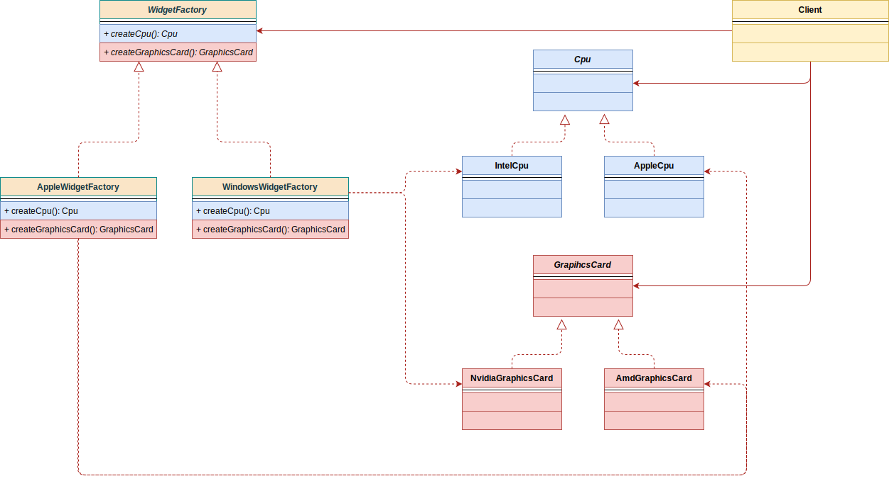

# 工厂（Factory）相关设计模式小结

> 概述

有三种创建型的工厂相关的设计模式：

* 抽象工厂
* 简单工厂
* 工厂方法

主要有两种区分：

1. 三种方式从下到上逐步抽象，并且更具一般性。
2. 简单工厂可以视为工厂方法的一种特例。

使用情况：

1. 编码时**不能预见**需要创建哪种类的实例。
2. 系统**不依赖于**产品类实例如何被**创建、组合和表达的细节**。

## 简单工厂（Simple Factory）

这个模式本身很简单，使用在业务较简单，具体产品很少扩展的情况下。

### 角色

* **工厂类角色**——模式核心，根据逻辑不同，产生具体的工厂产品。
* **抽象产品角色**——具体产品父类或接口，一般作为工厂的返回（以抽象方式返回）。
* **具体产品角色**——要创建的具体产品。

```java
/**
 * 简单工厂 -> 工厂抽象
 *
 * @author Jinhua
 * @date 2021/2/25上午12:23
 */
public class CpuFactory {

    /**
     * 简单判断，产生具体产品，但返回父类抽象
     *
     * @param type 判断逻辑依据
     * @return 返回父类产品抽象
     */
    public static Cpu createCpu(int type) {
        if (type == 1) {
            return new IntelCpu();
        } else {
            return new AppleCpu();
        }
    }
}
```

## 工厂方法（Factory Method）

## 场景

汽车作为产品，有奔驰和宝马的实际产品，它们的生产从奔驰工厂和宝马工厂来。

### 结构



### 对比分析

* 相对于**简单工厂**，**工厂方法模式**对工厂做了抽象，工厂的实现中生成具体的产品。

## 抽象工厂（Abstract Factory）

### 场景

组装电脑需要CPU和内存RAM，对于Windows和Mac（产品集成）来说，所需的是两个不同的系列CPU和RAM产品。

* Windows需要Windows系列的CPU和RAM
* Mac需要Mac系列的CPU和RAM。

### 结构



### 角色

* 抽象产品
* 具体产品
* 抽象工厂
* 具体工厂

### 适用性

1. 系统要**独立于**它的**产品的创建、组合和表示**；
2. 系统要由**多个产品系列中的一个**来配置；
3. 强调**一系列相关**的产品对象的设计以便进行联合使用；
4. 提供一个产品类库，但**只是要它的接口**而不是实现。

### 效果

#### 优势

1. **分离了具体的类**

   客户**通过抽象接口操作实例**。

   产品的类名在工厂的实现中被隔离。

2. **使得易于交换产品系列**

   一个具体工厂类在一个应用中仅在初始化的时候出现一次，所以改变具体工厂就能实现使用不同的产品。

3. **有利于产品的一致性**

   一个应用只能**使用同一个系列中的对象**。抽象工厂很容易实现这点。

#### 劣势

1. **难以支持新种类的产品**

   AbstractFactory确定了可以被创建的产品集合，扩展新产品必须保证**其所有子类都扩展**。

### 实现细节

1. **工厂作为单例模式（Singleton）**
2. **创建产品**
3. **定义可扩展的工厂**
