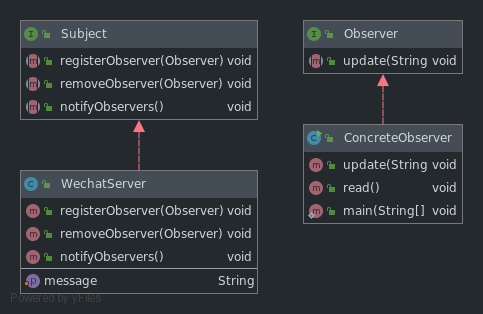

# 观察者模式（Observer）

## 描述

1. 别名：

   1. 发布（Publish）-订阅（Subscribe）模式；
   2. 模型（Model）-视图（View）模式；
   3. 源 - 收听者（Listener）模式。

2. 功能概述：

   ​		**一个被观察者**，管理所有依赖于它的**多个观察者**，并且在被观察者本身**状态发生改变**时候通知所有观察者。是一种一对多的关联关系引用，通常被用于事件处理系统。

## 模式结构图



## 角色解析

1. 抽象观察者 Observer

   为所有具体的观察者定义一个接口，在收到主题通知时候更新自己。

2. 抽象被观察者 Subject

   把所有观察者对象的引用保存到一个集合中，每个主题都可以有任意数量的观察者。抽象主题提供一个接口，可以**增加和删除观察者角色**。

3. 具体的被观察者 Concrete Subject

   具体的主题，在所有内部主题发生改变时候，向所有登记的观察者对象发出通知。

4. 具体的观察者 Concrete Observer

   实现抽象观察者所需的更新方法，使本身的状态与视图状态一致。

## 具体实现

   此处不再解析具体实现，详细见**代码注释**。

## JDK实现观察者模式分析

JDK中，java.util.Observable 抽象类和 java.util.Observer 接口，分别是JDK提供的抽象被观察者和抽象观察者。我们进行使用的时候，继承或实现他们，并重写相应方法即可。

### 抽象观察者 Observer

```java
package java.util;

/**
 * A class can implement the <code>Observer</code> interface when it
 * wants to be informed of changes in observable objects.
 *
 * @author  Chris Warth
 * @see     java.util.Observable
 * @since   JDK1.0
 */
public interface Observer {
    /**
     * This method is called whenever the observed object is changed. An
     * application calls an <tt>Observable</tt> object's
     * <code>notifyObservers</code> method to have all the object's
     * observers notified of the change.
     *
     * @param   o     the observable object.
     * @param   arg   an argument passed to the <code>notifyObservers</code>
     *                 method.
     */
    void update(Observable o, Object arg);
}

```

此接口很简单，提供一个更新消息的方法。两个参数

1. Observable ==> 发通知的被观察者。
2. Object ==> 通知的内容。

### 抽象被观察者 Observable

#### 标记是否改变状态的属性

```java
public class Main {
   private boolean changed = false;

   protected synchronized void setChanged() {
      changed = true;
   }

   protected synchronized void clearChanged() {
      changed = false;
   }

   public synchronized boolean hasChanged() {
      return changed;
   }
}
```

#### 添加和移除观察者，有判断

```java
public class Main {
   // 采用线程安全的Vector
   private Vector<Observer> obs;

   public Observable() {
      // 构造时候创建数组
      obs = new Vector<>();
   }

   public synchronized void addObserver(Observer o) {
      // 判空
      if (o == null) {
         throw new NullPointerException();
      }
      // 判断重复
      if (!obs.contains(o)) {
         obs.addElement(o);
      }
   }

   public synchronized void deleteObserver(Observer o) {
      obs.removeElement(o);
   }
}
```

#### 通知观察者的方法

```java
public class Main {
   public void notifyObservers() {
      notifyObservers(null);
   }

   public void notifyObservers(Object arg) {
      /*
       * a temporary array buffer, used as a snapshot of the state of
       * current Observers.
       */
      // 方法内部，存放观察者对象的数组
      Object[] arrLocal;

      // 对象锁，用于
      // 1. 判断对象的状态
      // 2. 拿到观察者的快照并放到 arrLocal数组
      synchronized (this) {
         /* We don't want the Observer doing callbacks into
          * arbitrary code while holding its own Monitor.
          * The code where we extract each Observable from
          * the Vector and store the state of the Observer
          * needs synchronization, but notifying observers
          * does not (should not).  The worst result of any
          * potential race-condition here is that:
          * 1) a newly-added Observer will miss a
          *   notification in progress
          * 2) a recently unregistered Observer will be
          *   wrongly notified when it doesn't care
          */
         if (!changed) {
            // 未改变则直接退出
            return;
         }
         // 得到快照，在同步块中，线程安全
         arrLocal = obs.toArray();
         // 清除变化状态
         clearChanged();
      }

      // 对快照数组逆序遍历通知
      for (int i = arrLocal.length-1; i>=0; i--) {
         ((Observer) arrLocal[i]).update(this, arg);
      }
   }
}
```

##### 重点分析带参的通知观察者的方法

1. 若对方法加锁，则观察者数量较多的时候，依次进行遍历通知将是一个非常耗时且消耗资源的操作。

2. 方法中的快照数组 arrLocal是线程安全的（方法存在于栈中）。将观察者属性数组转换为快照数组的时候，在同步块中，是线程安全的。

3. arrLocal数组缓存的作用体现在，如果一个线程添加观察者，一个线程删除，则会产生并发修改异常ConcurrentModifyException，有可能出现空指针异常。

4. 缓存机制的缺点。

   场景举例

   1. 线程1：调用notifyObservers() 方法通知。
   2. 线程2：删除观察者或添加观察者。

   一方面，新添加的不会立刻得到通知（除非添加完立刻又线程执行obs.toArray()方法）。

   另一方面，新删除的不会立刻停止通知。设计上不太好避免的问题。

5. Vector是一个线程安全的集合类，在进行toArray()方法的时候其他线程无法访问obs。

## 观察者模式的优势和不足

### 优势

1. **目标和观察者之间的抽象耦合**

   ​		目标仅知道自己有一系列的观察者实现同一个接口，并不知道观察者属于哪个具体的类，这样的耦合是最小的。

2. **支持广播通信**

   向注册的所有观察者通知，而不是特定的观察者，给了增加和删除观察者的自由。对通知的处理取决于观察者。

### 劣势

3. **意外的更新**

   由于无法知晓观察者的存在，对改变目标的代价一无所知。在目标对象的操作可能会引起一系列**对观察者以及依赖于观察者对象**的更新。若以来准则定义或维护不当，常常引起难以捕捉的错误更新。

   简单的更新协议**不提供具体的细节**说明目标中什么被改变了，就使得问题更加严重。

## 实现的细节

### 创建目标到观察者之间的映射

目标很多而观察者较少时候，目标中保存引用的存储代价太高。

解决办法是，创建一个关联查找机制来维护。

1. 优势：没有观察者的目标不产生开销。
2. 劣势：增加了访问观察者的开销。

### 观察多个目标

某些情况下，一个观察者观察多个目标。必须扩展update接口，将目标对象作为参数，让观察者知道发送通知的目标是谁。

```java
public interface Main {
   public void update(Subject s, Message msg);
}
```

### 谁触发更新

两个选择：

1. 目标对象改变后自动调用通知方法。
   * 优势：不需要客户操作；
   * 劣势：多个操作可能产生多个连续的更新，效率低。
2. 客户负责在适当时候调用notify方法。
   * 优势：避免中间不必要的更新，效率提升。
   * 劣势：客户调用，容易出错。

### 对已删除目标的悬挂引用

删除一个目标时，不应该在其所有观察者中遗留该目标对象的悬挂引用。一种做法是，在删除时候通知该观察者的引用复位。一般来说，不能简单的删除观察者，其他对象可能引用他们，或者他们本身在观察其他目标。

### 发通知前确保状态一致

### 避免特定于观察者的更新协议——推 / 拉 模型

常常需要实现传播目标改变的详细信息。目标可以将详细信息作为update的参数传递出去。极端的情况是：

1. **推模型**：目标始终发送详细信息，不管观察者是否需要；
2. **拉模型**：目标除了最小信息外什么也不发送。

### 显式指定感兴趣的改变

扩展目标的注册接口，指定感兴趣的改变，以提高更新效率。

```java
public interface Main {
   void attach(Observer o, Aspect interest);
}
```

同时在更新时候，将这些兴趣方面的改变作为参数传递。

```java
public interface Main {
   void update(Subject s, Aspect interest);
}
```

### 复杂的更新语义

当目标和观察者之间的依赖关系特别复杂时，可能需要一个维护这些关系的对象，我们将这些对象称为更改管理器（Change Manger）。其功能有三：

1. 将目标维护一个映射到其观察者，并提供一个接口来维护这个映射。解除目标来维护与其观察者关系引用的耦合。
2. 定义特定的更新策略。
3. 根据一个目标的请求，它更新所有依赖于这个目标的观察者。

基于关系更改管理器的类图如下：

