# 代理模式（Proxy）

## 意图

为其他对象提供一种**代理**，以控制这个对象的访问。

## 适用性

1. **远程代理（Remote Proxy）**

   为一个对象在**不同的地址空间**提供局部代表。

2. **虚代理（Virtual Proxy）**

   根据需要创建开销很大的对象。

3. **保护代理（Protection Proxy）**

   控制对原始对象的访问。适用于对象应该有不同访问权限的时候。

4. **智能指引**

   取代简单的指针，在访问对象时执行了一些**附加操作**。例如

   * 对指向实际对象的**引用计数**，当这个对象**没有引用**时候，可以**自动释放**它。
   * **第一次引用**一个持久对象时候，将它装入内存。
   * 在访问一个实例对象前，检查是否已经**锁定**了它，以确保其他对象不能改变它。

## 结构



## 参与者

1. **Subject**

   普通对象RealSubject和代理对象Proxy的抽象，这样就可以在任何使用普通对象的地方替换为代理对象。

2. **RealSubject**

   普通对象定义。

3. **Proxy**

   * 保存一个普通对象的引用，使得可以访问实体。
   * 实现Subject接口，即可用代理来替代普通对象。
   * 控制对实体的存取，并可能负责创建和删除它。

   其他功能依赖于代理的类型：

   * **Remote Proxy**

     负责对**请求及其参数**进行**编码**，向不同地址空间的实体发送已编码的请求。

   * **Virtual Proxy**
   
     缓存实体的附加信息，以便**延迟访问**。
   
   * **Protection Proxy**
   
     检查调用者是否有实现一个请求所需的访问权限。

## 实现

### 静态代理

1. **要求**：

   被代理对象和代理对象实现同一接口。

2. **优势**：

   不修改目标对象的前提下，扩展功能。

3. **不足**：

   1. 会产生过多的代理类。
   2. 不易于维护。一旦接口增加方法，目标对象和所有代理对象需要同步修改。

### 动态代理（JDK代理 / 接口代理）

* 利用了JDK的API，在运行时动态在内存中创建代理对象。

* 与静态代理的区别是：

  * 静态代理在编译时就已经实现，编译完成形成.class文件；
  * 动态代理编译完成时没有class文件，而是运行时生成字节码加载到jvm中。

* 特点：

  动态代理不需要实现接口，但要求目标对象必须实现接口（非抽象方法）。
  
#### 核心类

```java
public interface InvocationHandler {

    public Object invoke(Object proxy, Method method, Object[] args) throws Throwable;
}
```

### 实现类

```java
/**
 * 动态代理类模拟
 *
 * @author Jinhua
 */
public class MyInvocationHandler implements InvocationHandler {

    /**
     * 被代理对象的引用
     */
    private Object target;

    public MyInvocationHandler() {
        super();
    }

    /**
     * 拿到被代理对象
     *
     * @param target 被代理对象
     */
    public MyInvocationHandler(Object target) {
        super();
        this.target = target;
    }

    /**
     * 产生代理对象的方法
     *
     * @param proxy  代理对象
     * @param method 原有要增强的方法
     * @param args   方法的参数
     * @return 返回动态代理类对象
     * @throws Throwable 反射可能抛出的异常
     */
    @Override
    public Object invoke(Object proxy, Method method, Object[] args) throws Throwable {
        // 添加了代理方法
        if ("addPro".equals(method.getName())) {
            System.out.println("开启事务……");
            Object result = method.invoke(target, args);
            System.out.println("提交事务……");
            return result;
        } else {    // 未添加代理方法
            return method.invoke(target, args);
        }
    }

    public static void main(String[] args) {
        // 普通对象产生
        ProductService ps = new ProductServiceImpl();
        InvocationHandler ih2 = new MyInvocationHandler(ps);
        // 产生代理对象
        ProductService proxy = (ProductService) Proxy.newProxyInstance(
                ps.getClass().getClassLoader(),
                ps.getClass().getInterfaces(),
                ih2
        );
        proxy.addPro();
        System.out.println("---------");
        proxy.delPro();
    }
}
```

### CgLib继承代理

第三方代码生成类库，运行时在内存中动态生成子类对象，从而实现对目标对象的功能扩展。

底层通过使用一个小而快的字节码处理框架ASM，来转换字节码并生成新的类。不鼓励直接使用ASM，因为它需要你对JVM内部结构及class文件格式和指令集都很熟悉。

#### 特点

* 无需实现接口，达到代理类无入侵。想代理的对象没有接口实现类，即可使用CgLib实现。

#### 实现

```java
/**
 * CgLib继承代理
 *
 * @author Jinhua
 * @date 2021/3/13下午9:58
 */
public class ProxyFactory implements MethodInterceptor {

    /**
     * 目标对象
     */
    private final Object target;

    public ProxyFactory(Object target) {
        this.target = target;
    }

    public Object getProxyInstance() {
        // 工具类
        Enhancer en = new Enhancer();
        // 设置父类
        en.setSuperclass(target.getClass());
        // 设置回调函数
        en.setCallback(this);
        // 产生代理对象
        return en.create();
    }

    @Override
    public Object intercept(Object o, Method method, Object[] objects, MethodProxy methodProxy) throws Throwable {
        // 添加了代理方法
        if ("delPro".equals(method.getName())) {
            System.out.println("开启事务……");
            Object result = method.invoke(target, objects);
            System.out.println("提交事务……");
            return result;
        } else {    // 未添加代理方法
            return method.invoke(target, objects);
        }
    }

    public static void main(String[] args) {
        // 普通对象产生
        ProductService ps = new ProductServiceImpl();
        // 代理对象的产生
        ProductService proxy = (ProductService) new ProxyFactory(ps).getProxyInstance();
        System.out.println(proxy.getClass());

        proxy.addPro();
        System.out.println("---------");
        proxy.delPro();
    }
}
```

## 对比分析

1. 静态代理

   * 实现较简单。但只能为一个目标类的对象服务，如果目标类过多，会产生很多代理类。

   * 静态代理编译时产生class字节码文件，直接使用效率高。

2. JDK动态代理

   * 需要目标对象实现业务接口。代理类只需实现InvocationHandler接口。

   * 通过反射来代理方法，比较**消耗系统性能**，但可以**减少代理类的数量**，使用更灵活。

3. CgLib代理

   * 无需实现接口，通过生成类字节码实现代理，**比反射稍快**，不存在性能问题。但CgLib需要**继承**目标对象，需要重写方法，所以**目标类不能为终类**。