# 策略模式（Strategy）

## 意图

定义一系列算法，分别封装，使得它们**可以相互替换**。

## 类图



* **Strategy**

  支持所有算法的公共接口，Context调用这个接口来执行具体的算法，实现多态。

* **ConcreteStrategy**

  实现的具体算法。

* **Context**

  * 用实际的策略（ConcreteStrategy）来配置。
  * 维护一个对父类抽象Strategy的引用。
  * 可定义一个接口，让strategy来访问它数据。

## 示例

对两个数的操作策略。

1. 加法；
2. 减法。

### 策略接口类（Strategy）

```java
/**
 * 策略的接口
 *
 * @author Jinhua
 * @date 2021/3/7下午8:49
 */
public interface CalculateStrategy {

    /**
     * 对两个数的操作策略
     *
     * @param a a
     * @param b b
     * @return 计算结果
     */
    Integer calculate(Integer a, Integer b);
}
```

### 加法策略类

```java
/**
 * 加法策略
 *
 * @author Jinhua
 * @date 2021/3/7下午8:51
 */
public class AddStrategy implements CalculateStrategy {

    @Override
    public Integer calculate(Integer a, Integer b) {
        return a + b;
    }
}
```

### 减法策略类

```java
/**
 * 减法策略
 *
 * @author Jinhua
 * @date 2021/3/7下午8:53
 */
public class SubStrategy implements CalculateStrategy {

    @Override
    public Integer calculate(Integer a, Integer b) {
        return a - b;
    }
}
```

### 上下文环境

```java
/**
 * 算法执行的上下文环境
 *
 * @author Jinhua
 * @date 2021/3/7下午8:54
 */
public class Context {

    private final Integer a;
    private final Integer b;

    @Setter
    private CalculateStrategy strategy;

    public Context(Integer a, Integer b) {
        this.a = a;
        this.b = b;
    }

    public Context(Integer a, Integer b, CalculateStrategy strategy) {
        this.a = a;
        this.b = b;
        this.strategy = strategy;
    }

    /**
     * 提供Strategy对策略访问的方法
     *
     * @return 策略执行结果
     */
    public Integer getResult() {
        return strategy.calculate(this.a, this.b);
    }

    public static void main(String[] args) {
        Context context = new Context(4, 5);
        context.setStrategy(new AddStrategy());
        // return 9
        System.out.println(context.getResult());

        // 改变策略
        context.setStrategy(new SubStrategy());
        // return -1
        System.out.println(context.getResult());
    }
}
```

### 枚举方式优化

```java
/**
 * 枚举方式扩展策略
 *
 * @author Jinhua
 * @date 2021/3/7下午9:36
 */
public enum CalculateStrategyEnum implements CalculateStrategy {

    /**
     * 加法策略
     */
    ADD {
        @Override
        public Integer calculate(Integer a, Integer b) {
            return a + b;
        }
    },

    /**
     * 减法策略
     */
    SUB {
        @Override
        public Integer calculate(Integer a, Integer b) {
            return a - b;
        }
    },

    /**
     * 乘法策略
     */
    MULTI {
        @Override
        public Integer calculate(Integer a, Integer b) {
            return a * b;
        }
    };

    @Override
    public abstract Integer calculate(Integer a, Integer b);

}
```

## 效果

### 优势

1. 抽象了一个算法接口作为调用入口，有助于分析这些算法的共性。
2. 通过多态，消除了一些条件判断语句。
3. 算法都已经封装，客户可以自行选择。

### 劣势

1. 客户必须了解不同Strategy之间的区别，才能作出选择。
2. Strategy和Context之间的通信开销。
3. 策略类的数目。每一种策略会增加一个策略类。

## 应用举例

* JDBC结果集处理为不同的类型，需执行不同的策略。
  * 定义策略接口为 ResultSetHandler
  * 策略实现为
    * BeanHandler
    * BeanListHandler
    * MapHandler