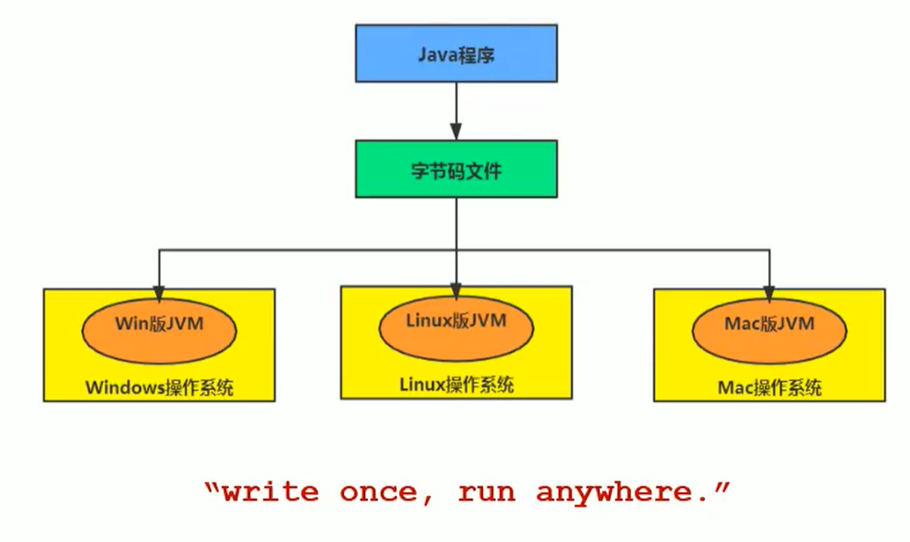
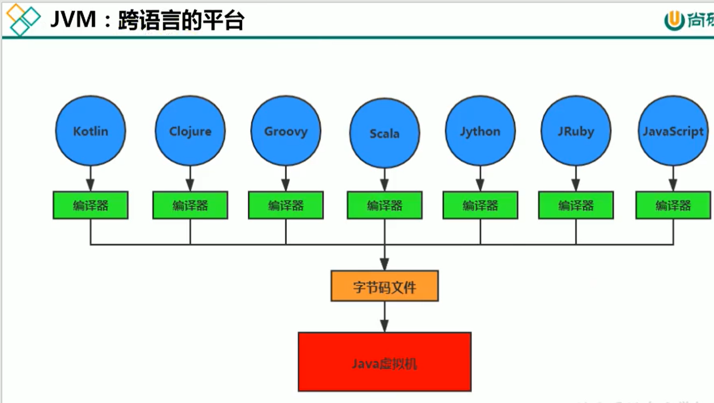

# 01_JVM概述

## JVM与Java体系结构

- Java --> **跨平台的语言**

  - 不同的操作系统提供了不通过版本的jvm，来实现对相同字节码文件的解析。

- 

- JVM --> **跨语言的平台**

  - 不同语言只要提供各自的编译器，编译为jvm规范的字节码文件，那么jvm上都能运行。

- 
  - 随着**Java 7**发布，Java虚拟机的设计者们通过JSR-292规范基本实现在Java虚拟机平台上运行**非Java语言编写的程序**。

  - JVM本身不关心在其内部运行的程序到底是什么语言编写的，它**只关心字节码文件**（我认为这也是程序设计低耦合的一种体现）。

  - Java不是最强大的语言，但**JVM是最强大的虚拟机**！！！

  - IT界三大难题：

    - CPU
    - 操作系统
    - 编译器

- 多语言的编程

  - 通过**特定领域的语言**去解决**特定领域的问题**是当前软件开发应对日趋复杂的项目需求的一个方向。

  - 举例：

    **并行处理**用clojure，**展示层**用JRuby/Rails，**中间应用处理层**用Java，接口对每一层的开发者都是透明的。各种语言的交互不存在任何困难，它们最终运行在JVM上。

- 如何真正搞懂JVM

  - 自己写一个。（如果不考虑性能和商用稳定性）

- 虚拟机与Java虚拟机

- - 虚拟机（Virtual Machine），就是一台虚拟的计算机。是**一款软件**，用于**执行一系列虚拟计算机指令**。大体上可以将虚拟机分为**系统虚拟机**和**程序虚拟机**。

  - - **系统虚拟机**

      如Virtual Box，VMWare，它们完全是**对物理计算机的仿真**，提供了一个可以完整运行操作系统的软件平台。

    - **程序虚拟机**

      最典型的是Java虚拟机，为专门**执行单个计算机程序**而设计，在Java虚拟机中执行的指令我们称为Java字节码指令。

  - 无论系统虚拟机和程序虚拟机，在上面运行的软件都**被限制于虚拟机提供的资源**中。

  - Java虚拟机

  - - 概念与概述

    - - 执行Java字节码的虚拟计算机
      - JVM平台的各种语言可以共享Java虚拟机带来的**跨平台性**、**优秀的垃圾回收器**，以及**可靠的即时编译器**。
      - Java技术的**核心就是Java虚拟机**（Java Virtual Machine）

    - 作用

      二进制字节码的运行环境

    - 特点
    - - 一次编译，到处运行（Write Once, run anywhere.）
      - 自动内存管理；
      - 自动垃圾回收；

## JVM位置与整体架构

### JVM的位置

* 运行在操作系统上，没有与硬件直接交互

  

### JVM整体结构与Java代码执行流程

