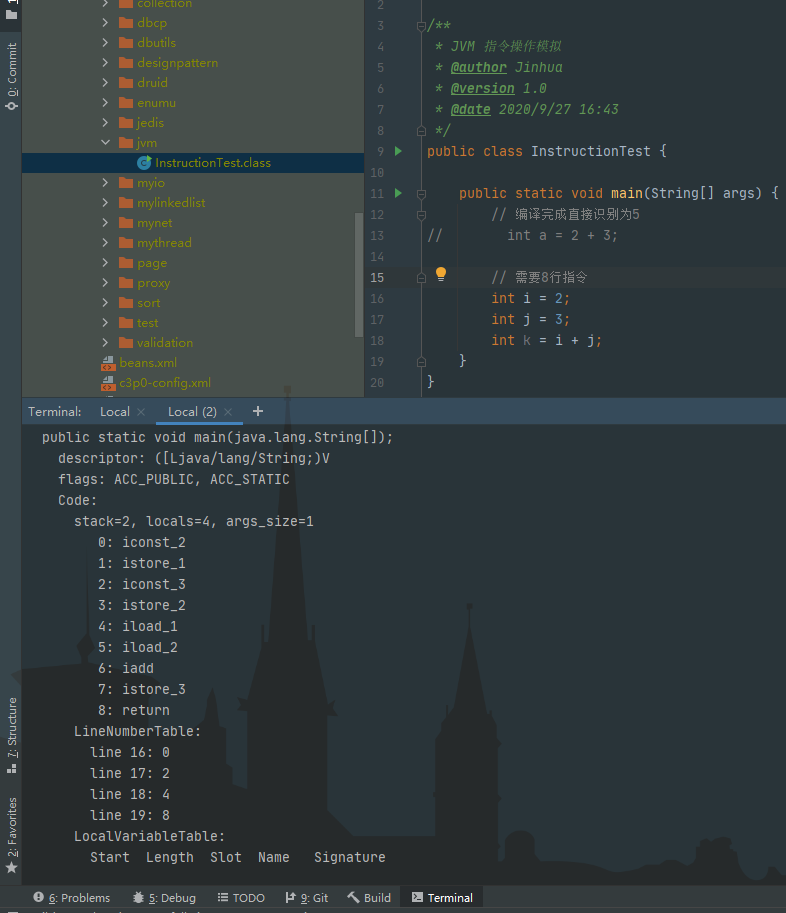

# 03_JVM架构模型与生命周期

## 一、JVM架构模型

### 1. 指令集架构分类

1. 基于栈的指令集架构（Java编译输入的指令流属于该种）
   * 设计和实现更简单，适用于资源受限的系统（**小型的，嵌入式的**）；
   * 避开了寄存器分配难题，使用**零地址指令**【只有操作数，没有地址，每8位对齐】方式分配；
   * 指令流当中的指令大部分是**零地址指令**，其执行过程依赖于**操作栈**。指令集更小【零地址指令】，编译器更容易实现；
   * 不需要硬件支持，可移植性更好，更好实现跨平台。
2. 基于寄存器的指令集架构
   - 典型应用是**x86二进制**指令集：传统的PC，Android的Davlik虚拟机；
   - 指令集架构完全依赖于硬件，可移植性差【缺点】；
   - 性能优秀，执行更高效【优点】；
   - 花费更少的指令去完成一项操作【每16位对齐】；
   - 大部分指令以**一地址指令**【只有一个地址，一个操作数】，二地址指令和三地址指令为主。

### 2. Java基于栈式的指令集架构举例

> 例一：执行 a + b 字节码

字节码内容说明：

* iconst_2  // 常量2定义
* istore_1  // 常量2存入操作数栈索引为2的位置
* iconst_3
* istore_2
* iload_1  // 加载
* iload_2
* iadd  // 常量2和3出栈，执行相加
* istore_3  // 结果5出栈，保存到操作数栈索引为2的位置

> 例二： 执行 (a + b) * c 字节码

#### 优缺点小结

* 优势

  跨平台性、指令集小、指令多

* 劣势

  执行性能比基于寄存器的架构差

## 二、JVM的生命周期

1. 虚拟机的启动
   * 通过引导类加载器（BootStrap ClassLoader）创建一个初始类（initial class）来完成
   * 初始类（initial class）有虚拟机的**具体实现**（HotSpot / classic）指定。

2. 虚拟机的执行
   * 一个运行中的Java虚拟机有一个清晰的任务，执行Java程序；
   * 程序开始执行时它才运行，程序结束时它就停止。
   * 执行一个所谓Java程序的时候，真正在执行的是一个叫做Java虚拟机的进程。
3. 虚拟机的结束
   * 结束的情况
     * 程序正常执行结束；
     * 执行过程中遇到异常或错误而终止；
     * 操作系统出现错误导致Java虚拟机进程终止；
     * 某线程调用了System.exit()方法，或Runtime类的halt()方法，并且安全管理器也允许这次exit()或halt()操作。
     * 除此之外，JNI (Java Native Interface)规范描述了用JNI Invocation API来加载/卸载Java虚拟机，Java虚拟机的退出情况。