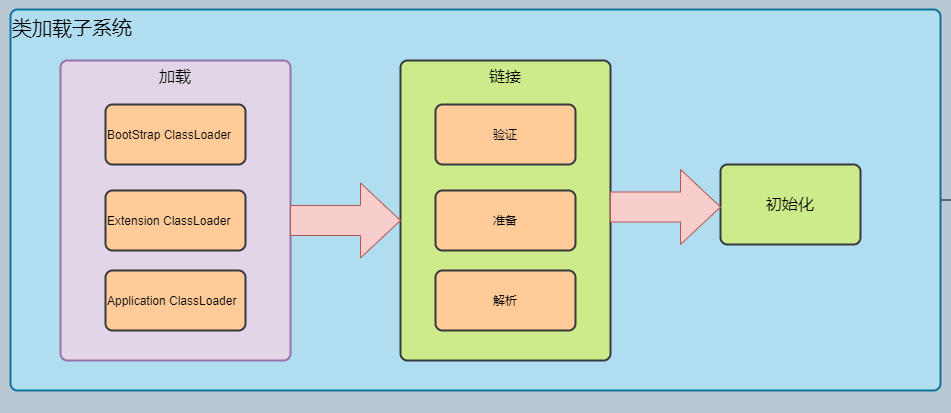
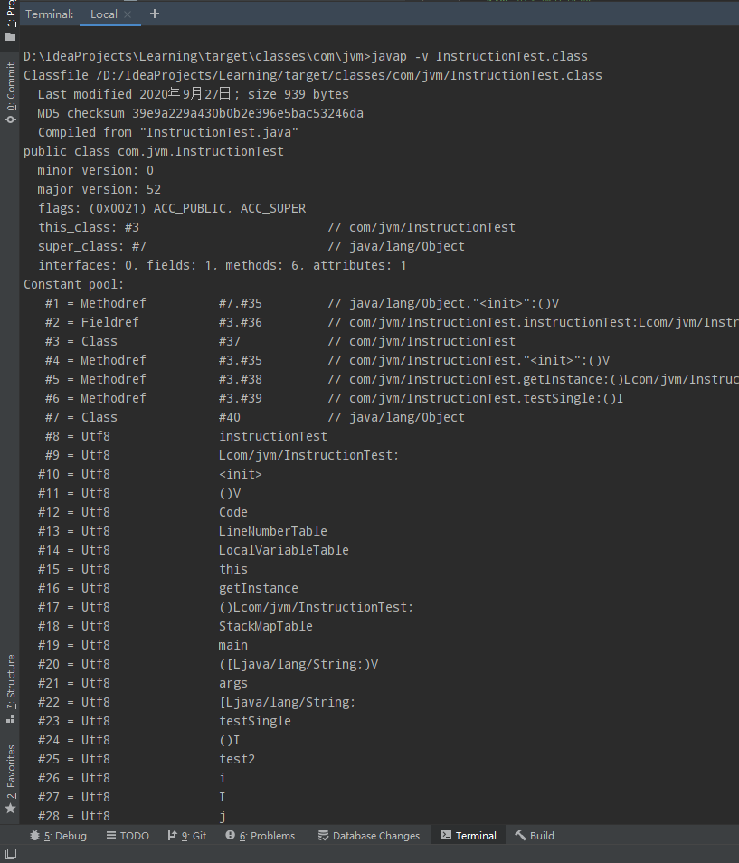
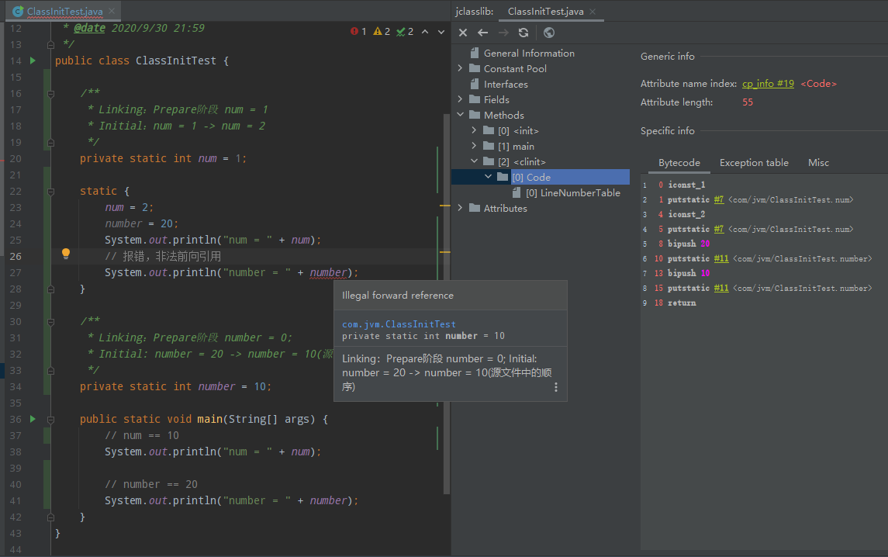
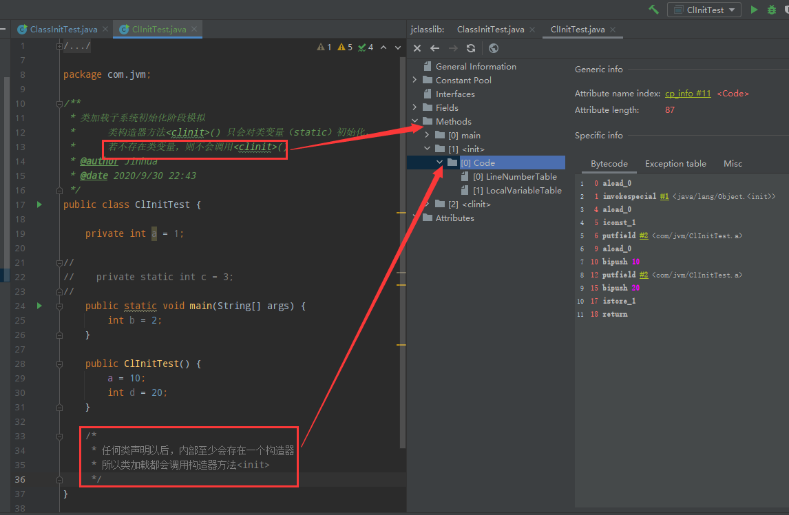
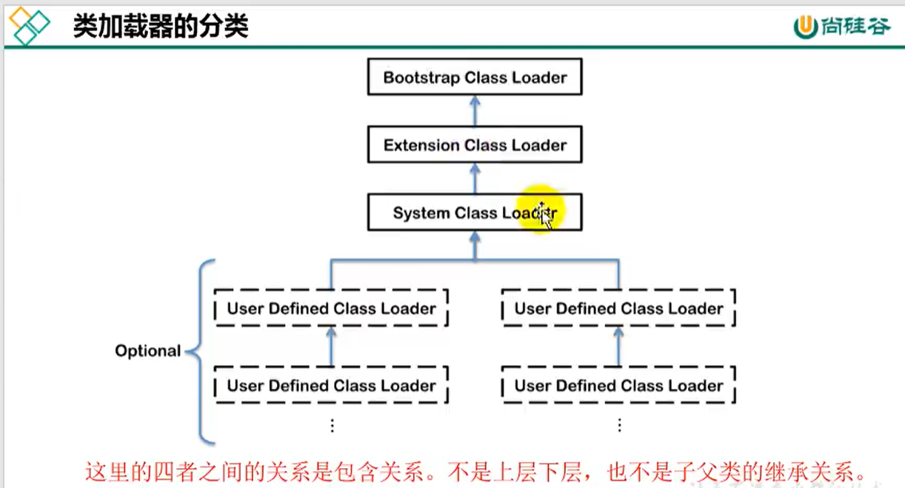
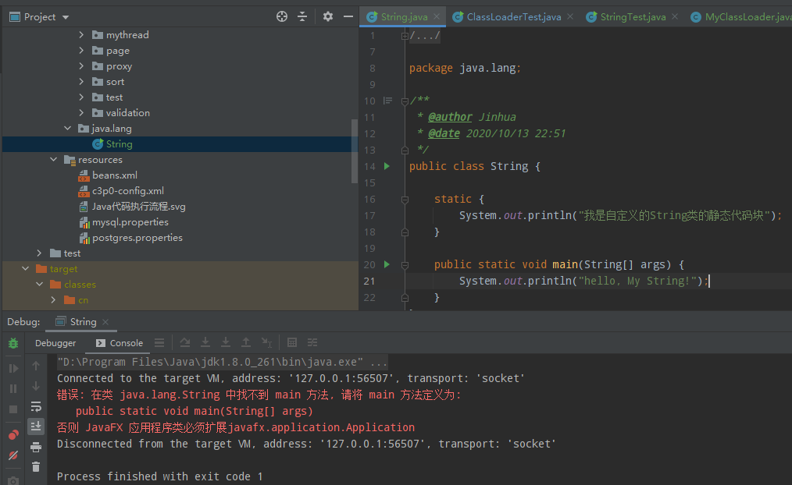
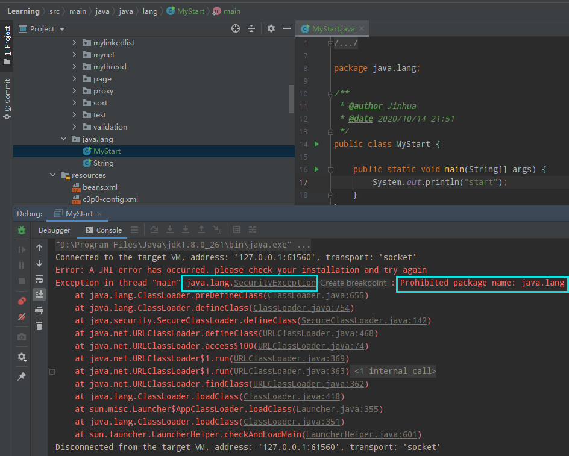

# 04_类加载子系统

## 结构

* 结构如下图所示

  

* 职责说明

  * 负责从文件系统或网络中加载class文件（class文件在文件开头有特殊的标识，比如cafebabe）

  * ClassLoader只负责类的**加载**，至于它是否可运行，由Execution Engine（执行引擎）决定。

  * 加载的**class类信息**存在Method Area（方法区）。除了类信息，方法区还会存放**运行时常量**信息，如下图的常量池。

    

## 加载过程

### 加载（Load）

1. 通过**全类名**获取定义此类的**二进制字节流**；
2. 将这个字节流的**静态存储结构**转化为**运行时数据结构**存放于**方法区**；
3. 在内存中生成一个**代表这个类**的java.lang.**Class类型类的实例化对象**，作为方法区这个类的数据访问入口。
4. 补充，class文件获取方式：
   * 从**本地文件系统**直接加载；
   * 通过**网络**获取，典型场景：Web Applet；
   * 从**zip压缩包**获取，成为今后jar，war格式的基础；
   * **运行时计算**生成，使用最多的是，**动态代理**技术；
   * 由**其他文件**生成，典型场景：JSP应用；
   * 从专有的**数据库提取**class文件，比较少见；
   * 从**加密文件**中获取，主要作为防止反编译的措施。

### 链接（Link）

> 验证（Verify）

1. 目的和意义
   - 确保class文件字节流包含的信息符合当前虚拟机要求，保证被加载类的正确性，不会危害虚拟机安全。
2. 验证内容
   * 文件格式；
   * 元数据；
   * 字节码；
   * 符号引用。

> 准备（Prepare）

* 为**类变量（类中static修饰，非final）**分配内存，并设置该类变量的**默认初始值**，即零值。
* **类常量（static final）**在**编译时**候就会分配，准备阶段会**显式准备**该值。
* 不会为实例变量初始化（没创建对象，类变量分配在方法区中）

> 解析（Resolve）

* 将常量池中的**符号引用**转换为**直接引用**的过程。
* 解析操作意味着，初始化之后再次执行解析。
* 符号引用就是**一组符号**来描述引用的目标，符号引用定义在【Java虚拟机规范】的class文件格式中。**直接引用**就是直接指向目标的指针、相对偏移量或一个间接定位到目标的句柄。
* 解析动作主要针对**类或接口、字段、类方法、接口方法、方法类型**等。对应常量池中的CONST_Class_info，CONST_Fieldref_info，CONST_Methodref_info等。

### 初始化（Initial）

* 执行类构造器方法<clinit>()的过程。此方法不需定义，由javac编译器自动收集类中的所有类变量的赋值动作和静态代码块中的语句合并而来。

* 构造器方法中指令按语句在源文件中顺序执行。

* 若一个类具有父类，jvm会保证子类的<clinit>执行前， 父类的<clinit>已经执行完毕。

* 虚拟机必须保证一个类的<clinit>方法在多线程下被同步加锁。

  

* <init>() => 任何类加载都会调用该方法

  * 任何类声明后，内部至少会存在一个构造器（默认空参public）

  

## 类加载器

### 分类



* 非上下层关系，非继承关系的个人理解：
  * 同为ClassLoader的具体类型，相当于**枚举对象**，只是**用链来描述他们之间加载与被加载的关系**。

### 详细分类说明

按JVM规范，严格意义上将类加载器分为两类：

> 1. 引导类加载器（BootStrap ClassLoader）

- 非Java语言编写（C/C++语言实现，嵌套在JVM内部）；

- 加载Java**核心类库**，提供JVM自身需要的类：

- - %JAVA_HOME%/jre/lib/

  - - rt.jar
    - resources.jar
    - sun.boot.class.path下的内容

- 不继承自java.lang.ClassLoader，没有父加载器；
- 可以对ExtClassLoader和AppClassLoader进行加载，并为他们指定父加载器；
- 出于安全考虑，BootStrap启动类加载器只加载包名为java，javax，sun等的类；

> 2. 自定义类加载器（User-Defined ClassLoader）

- 从概念上讲，自定义类加载器是**开发人员自己定义**的类加载器；

- 从Java虚拟机规范讲，将所有**派生于抽象类**ClassLoader的类加载器都划分为自定义类加载器。

- 详细分类

  - 扩展类加载器（Extension     ClassLoader）

  - - Java语言编写，由sun.misc.Laucher$ExtClassLoader实现；
    - 派生于java.lang.ClassLoader类；
    - 父类加载器为启动类加载器（这里应该理解为扩展类加载器由启动类加载器进行加载，**不是继承关系**）
    - 从java.ext.dirs系统属性所指定的目录中加载类库，或从jdk安装目录下的**jre/lib/ext子目录**（扩展目录）加载类库。如果用户的jar放到此目录，也会由扩展类加载器进行加载。

  - 应用程序类加载器（AppClassLoader）

  - - Java语言编写，由sun.misc.Laucher$AppClassLoader实现；
    - 派生于java.lang.ClassLoader类；
    - **父类加载器为扩展类加载器**。
    - 从环境变量classpath或系统属性java.class.path路径加载类库；
    - 程序中默认的类加载器，可通过ClassLoader#*getSystemClassLoader*()获取

  - 用户自定义类加载器（User-Defined ClassLoader）

  - - 目的

    - - **隔离**加载类

      - - 工程中不同中间件某些类路径一样，类名相同导致**冲突**，所以需要**类的仲裁**

      - 修改类的**加载方式**

      - **扩展加载源**

      - **防止源码泄露**

    - 实现方式

    - - 继承抽象类，java.lang.ClassLoader
      - JDK1.2之前，继承ClassLoader并重写loadClass()方法，之后版本不推荐，而是重写findClass()方法中。
      - 若无太过于复杂的需求，则可以直接继承URLClassLoader类，避免繁琐的操作。

### ClassLoader常用方法

> loadClass方法

- ```java
  public Class<?> loadClass(String name) throws ClassNotFoundException;
  
  protected Class<?> loadClass(String name, boolean resolve) throws ClassNotFoundException;
  ```

- 加载全类名为name的类，返回一个java.lang.Class的对象

> findClass方法

- ```java
  protected Class<?> findClass(String name) throws ClassNotFoundException {
  	throw new ClassNotFoundException(name);
  }
  ```

- 加载全类名为name的类，返回二进制数组

> defineClass方法

- ```java
  protected final Class<?> defineClass(String name, byte[] b, int off, int len) throws ClassFormatError {
      return defineClass(name, b, off, len, null);
  }
  ```

- 加载指定全类名的某起始到结束的字节数组，返回java.lang.Class的对象。常与第二个方法findClass(String name)搭配使用。

> 获取ClassLoader的几个途径

1. 获取**当前类**的ClassLoader

   ```java
   this.getClass().getClassLoader();
   ```

2. 获取**当前线程上下文**的ClassLoader

   ```java
   Thread.currentThread().getContextClassLoader();
   ```

3. 获取**系统**的ClassLoader

   ```java
   ClassLoader.getSystemClassLoader();
   ```

4. 获取**调用者**的ClassLoader

   ```java
   DriverManager.getCallerClassLoader();
   ```

## 双亲委派机制与沙箱安全机制

### 双亲委派机制



> 概述

Java虚拟机对class文件采用**按需加载**的方式，当需要使用该类时才将它的class文件加载到内存生成class对象。加载某个类的class文件时候，JVM采用的是**双亲委派**机制，即把请求**交给父加载器**处理，它是一种**任务委派**模式。

> 工作原理

- 一个类加载器收到了类加载请求，自己并不会去加载，而是把这个**请求委托给父加载器**去执行；
- 如果父加载器还存在父加载器则**继续向上委托**，直至达到最顶层的启动类（BootStrap     ClassLoader）
- 如果父类加载器可以完成加载任务，就成功返回；**若父类加载器无法完成**此加载任务，**子类加载器**才会**尝试去加载**。

> 举例

1. 自定义同包名的String类

   根据双亲委派机制，加载的类其实是**核心api的final String**类，而这个类没有main方法，所以报错。

   

2. 与核心包名相同但**核心包中不存在**，也会报安全错误。

     

### 沙箱安全机制

- 自定义的java.lang.String类，加载该java.lang包下的类会率先使用BootStrapClassLoader加载，会率先加载rt.jar包的java.lang.String.class文件，报错信息提示无main方法，因为加载的时候是核心类库中的String。这样达到了**对java核心源代码的保护**，称为沙箱安全机制。

- 个人思考：

- - 双亲委派机制是否可理解为沙箱安全机制的实现方法。

## 很多细节问题需要看代码实现