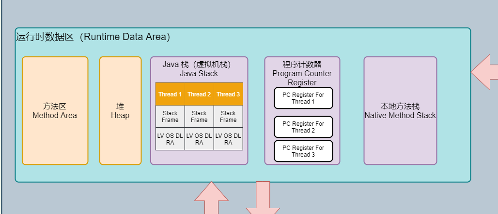
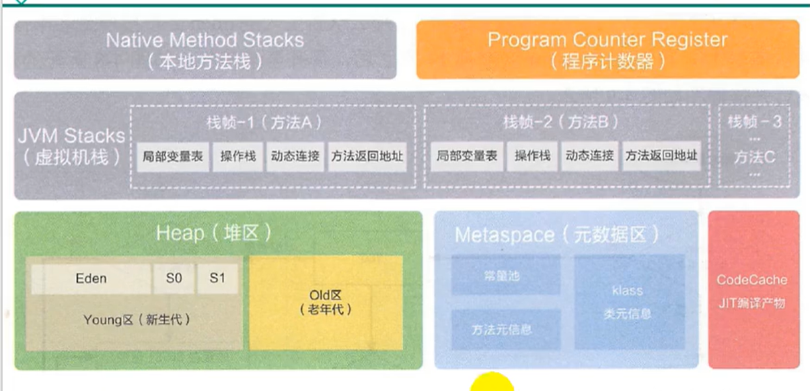

# 05_运行时数据区(Runtime Area)

## 概述

> 内存

- **内存**是非常重要的系统资源，是硬盘和CPU的**中间仓库及桥梁**，承载着操作系统和应用程序的实时运行。
- **JVM内存布局**规定了Java程序在运行过程中**内存申请**、**分配**、**管理**的策略，保证了JVM的高效、稳定运行。
- **不同JVM**对内存划分方式和管理机制**存在差异**。比如JRockit和J9虚拟机无Method Area（方法区）。

> HotSpot JVM **运行时数据区**

1. **方法区（Method Area）**和**堆（Heap）**线程共享

   * 方法区 => 元数据 + JIT编译产物
   * 堆 => 主要是对象

   关于线程共享的说明 => 每一个JVM只有一个java.lang.Runtime（运行时）对象

2. **虚拟机栈（Java Stack）**、**程序计数寄存器（Program Counter Register）**和**本地方法栈（Native Method Stack）**线程独享。

   * 生命周期**与线程一致**，随线程创建而创建，随线程销毁而消亡。

## 程序寄存计数器(Program Counter Register)

### 概述

1. Register命名来源于CPU的寄存器，**存储指令相关**的现场信息，CPU只有把数据装载到寄存器才能运行。

2. JVM中的Program Counter Register是对物理PC寄存器的一种**抽象的模拟**，或许翻译为**PC计数器**更贴切。

3. 是一块很小的，在内存中**运行速度最快**的内存空间，几乎可以忽略不记。

4. 每一个线程有一个PC程序计数器（**线程私有**），生命周期与线程一致。

5. **任何时间**，**一个线程**都只有**一个方法**在执行，即所谓的**当前方法**。

   * 程序计数器会存储**当前线程正在执行的方法**的JVM**指令地址**。
   * 如果执行的是**native方法**，则是**未指定值（undefined）**。

6. 它是程序**控制流指示器**，分支、循环、跳转、异常处理、线程恢复等基础功能都需要依赖PC程序计数器完成。

7. 字节码解释器工作时，就是通过**改变计数器值**来**选取下一条**需要执行的字节码指令。

8. JVM规范中唯一一个**没有OutOfMemoryError**的区域。

   | 内存区域               | 是否有GC（垃圾回收） | 是否有OOM（内存溢出） |
   | ---------------------- | -------------------- | --------------------- |
   | Java Stack（虚拟机栈） | 否                   | 是                    |
   | Heap（堆）             | 是                   | 是                    |
   | Method Area（方法区）  | 是                   | 是                    |
   | PC寄存器               | 否                   | 否                    |

### 工作流程

#### 作用描述

#### 工作原理示例

#### 面试中两个常见问题

1. 使用PC寄存器**存储字节码指令地址**有什么用？为什么使用PC寄存器记录**当前线程的执行地址**呢？

   

   * CPU需要**不停切换线程**，当切换回来的时候，就得知道**接着从哪个指令开始**执行。
   * JVM的字节码解释器就是通过改变PC寄存器**所存的字节码指令地址**的值来明确下一条该执行的指令。

2. 为什么PC寄存器为什么被设定为**每个线程独有一份**？

   * 记录**每个线程**正在执行的**当前字节码指令地址**，最好的办法是每个线程一份。这样各个线程直接可以进行**独立计算**， **不会互相干扰**。