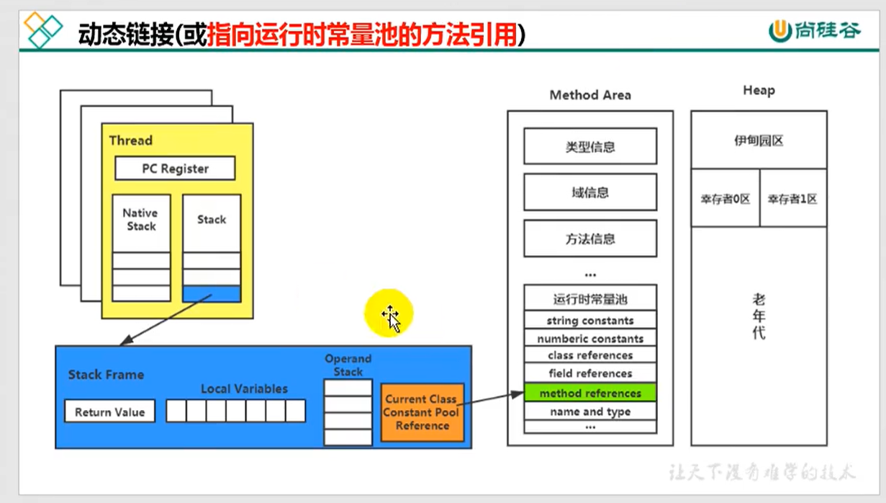
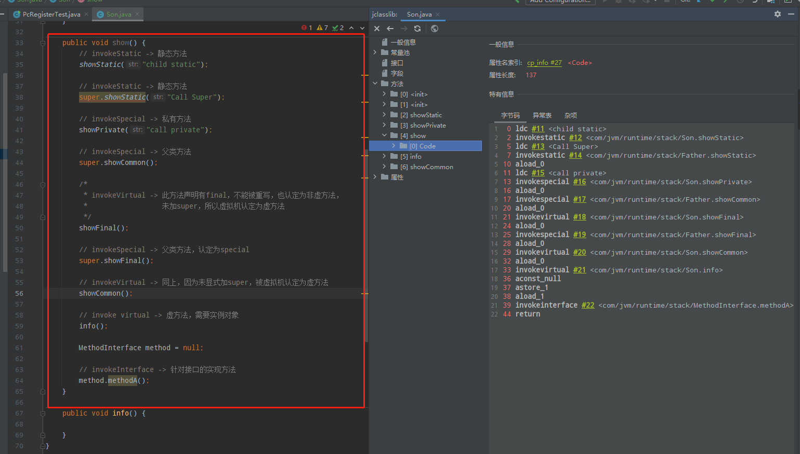
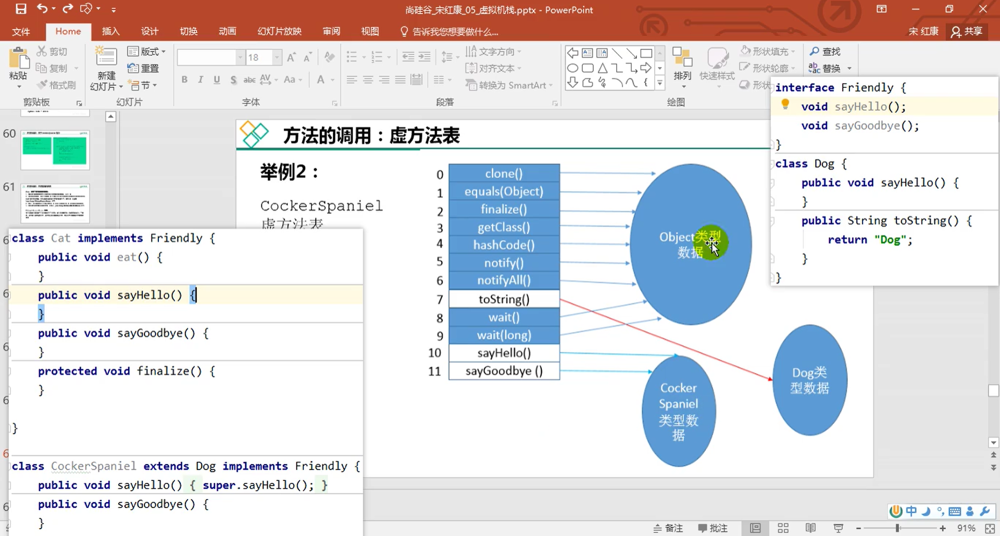

# Java栈（虚拟机栈）

## 一、Java栈 概述


### 1. 指令集 ==> **零地址指令**

由于跨平台的设计，Java指令集都是根据**栈结构**来设计。不同平台的**CPU架构不同**，所以**不能基于寄存器**架构设计。

* **零地址指令**
* 优势：
    * 跨平台
    * 指令集小
    * 编译器容易实现
    * 劣势：性能下降，实现同样的功能需要更多的指令。

### 2. 生命周期 ==> **与线程一致**

* 每个线程创建时都会创建一个虚拟机栈（Java Virtual Machine Stack），其内部保存一个个栈帧（Stack Frame），**入栈和出栈**对应着一次次**Java方法的调用。**
* Java栈是**线程私有**的。

### 3. 职责概述

1. 作用

    - 主管Java程序的运行，它保存方法的**局部变量**（8种**基本数据类型的值**、对象的**引用地址**）、**部分结果**，并参与方法调用和返回。

2. 优势

    - **快速有效**的分配存储的方式，访问速度仅次于程序计数器；

    - JVM堆Java虚拟机栈的**操作简单**，只有两个：

    - - 每个方法的执行，入栈（push）；
    - 方法执行完，出栈（pop）；

    - **不存在垃圾回收**

    - - GC；
    - OOM：存在，一直压栈导致栈溢出。StackOverflowError；

3. 可能出现的异常 ==> Java虚拟机规范允许Java栈的大小是**动态**或者**固定不变**的。

    * 可能存在OOM

        - 虚拟机栈**大小动态扩展**，在尝试扩展时候无法申请到足够内存；
        - 创建线程时候**没有足够内存**去创建对应的虚拟机栈。

    * 可能存在栈溢出

      ```java
      public class StackErrorTest {
      
          private static int count = 1;
      
          public static void main(String[] args) {
      
              /*
               * 1. 默认情况，count = 5885 时候抛异常；
               * 2. 设置栈大小，Xss = 256k时，count = 1928 时候抛异常
               */
              System.out.println("count = " + count++);
              main(args);
          }
      }
      ```

### 4. 运行过程

1. 存储单位 ==> **栈帧**
2. 运行原理
3. 内部结构
    * 局部变量表（Local Variables）
    * 操作数栈（Operand Stack）（或表达式栈）
    * 动态链接（Dynamic Linking）（或指向运行时常量池的方法引用）
    * 方法返回地址（Return Address）（或方法正常退出或异常退出的定义）
    * 附加信息

## 二、局部变量表（Local Variables）

1. 别名

    * 局部变量数组
    * 本地变量表

2. 结构解析
   

    * LineNumberTable ==> **代码开始行号**与**字节码开始行号**对应表

        * **start PC**：字节码开始行号
        * **Line Number**：代码开始行号

    * LocalVariable ==> **局部变量**的描述信息

      | **变量名** | **中文含义**| **说明**|
      | --------- | ---------- | -------- |
      | 开始start  | 字节码开始行号 |  |
      | length | 变量的字节码作用行长度 |  |
      | name       | 变量名 |  |
      | Signature  | 变量描述 | 开头 [ 代表数组     L 代表引用类型 |

3. 局部变量表的理解

    1. 定义为一个数字数组，主要存储**方法参数**和定义在**方法内的局部变量**；
        * 8种**基本数据类型**；
        * 对象的**引用**
        * **returnAddress类型**
    2. 局部变量表建立在**线程独立**的栈的栈帧上，线程私有，**不存在数据安全问题**。
    3. 局部变量表的所需容量大小在**编译期间确定**。保存在方法的Code属性的maxim local variables数据项中。局部变量表在**运行期间大小不变**。
    4. **方法嵌套**调用的最大次数由**栈的大小**决定。
    5. 局部变量表中的**变量只在当前方法调用中有效**。调用结束后局部变量表会随着栈帧的销毁（出栈）而销毁。

4. 关于槽（slot）的理解

    1. 局部变量表中，**最基本的单元**Slot
    2. 参数值的存放总是在局部变量数组，索引范围 [0, length -1]
    3. 存放编译期可知的变量。
    4. 数据占用情况
        1. **32位以内**的类型（byte, short, int, char, boolean）**占用一个slot**
            * byte, short, char在存储前被转为int
            * boolean也被转位int，0表示false，非0表示true
        2. 64位类型（double, long）占用**两个slot**
    5. JVM会为局部变量表中的每一个Slot分配一个**访问索引**，通过索引访问变量值；
    6. **实例方法被调用**，方法参数和方法体内部变量都会**按定义顺序**被复制到变量表的每一个Slot
    7. 访问占**两个slot的64位的数据**（double, long）时，**使用起始索引**
    8. 如果当前栈帧由**构造方法或者实例方法**创建，则局部变量表的**index = 0 的位置**存放**当前对象的引用（this）**
        * **静态方法中不能使用this** -> this不存在于静态方法的局部变量表中。
    9. Slot是可以**重复利用**的。如果一个**局部变量过了其作用域**，那么在其作用域之后声明的局部变量就**可能复用过期的局部变量的Slot**，节省资源。

5. 变量分类

    1. 按数据类型

        * 基本数据类型
        * 引用数据类型

    2. 按在类中声明位置

        1. 成员变量

            1. 类变量 / 静态变量（static）

                * **Linking（链接）**的**Prepare（准备）**阶段，**默认赋值**
                * **Initialization（初始化阶段**），进行**静态代码块赋值**（若有静态代码块），或**显式赋值**。

            2. 实例变量

               对象创建，会在**堆空间**中分配实例变量空间，并进行**默认赋值**。

        2. 局部变量

           使用前，必须显式赋值，否则编译不通过。

            ```java
            int b;
            b+=2;
            ```

6. 小结

    * **栈帧性能调优**关系最为密切的部分就是局部变量表。方法执行时，虚拟机使用**局部变量表完成方法的传递**。
    * 局部变量表中的**变量也是重要的垃圾回收根节点**，只要被局部变量表**直接或者间接引用的对象**，都不会被回收。

## 三、操作数栈（Operand Stack）

* 在方法执行过程中，执行引擎根据字节码指令，往操作数栈中写如数据和提取数据；

  * 某些字节码指令（如bipush）将值入栈，其他字节码指令（比如iload）提取操作数出栈
* 比如：复制，交换，求和等操作

* 主要用于**保存中间结果**，同时作为计算过程中**变量的临时存储空间**；

* 是JVM执行引擎的一个工作区，**一个方法开始执行，一个新的栈帧也随之创建，操作数栈为空**（并非null，**容量在编译期确定**，保存在方法的Code属性中，为max_stack的值）；

* 操作数栈单位深度与Slot大小一致

  * 32位占一个栈单位深度
* 64位占两个栈单位深度

* 操作数栈用**数组实现**，但**只能通过入栈和出栈来访问**。

* 被调用的方法**带返回值**，则返回值也会被压入操作数栈，并且更新**PC寄存器**中下一条需要执行的字节码指令。

* 操作数栈中的**元素数据类型**与**字节码指令序列**严格匹配，两次验证

  * 编译器在**编译期**间进行验证
* **类加载过程**中的 类检验 -> 数据流分析 阶段再次验证

* Java虚拟机的解释引擎是基于操作数栈的执行引擎。

## 四、代码追踪

1. 非静态方法求和操作举例

    * 代码

      ```java
      public void testAddOperation() {
          byte i = 15;
          int j = 8;
          int k = i + j;
      }
      ```

    * 对应字节码指令

      ```c
      Code:
          stack=2, locals=4, args_size=1
              0: bipush        15
              2: istore_1
              3: bipush        8
              5: istore_2
              6: iload_1
              7: iload_2
              8: iadd
              9: istore_3
              10: return
      ```

    * 解释

        * bipush -> 将值压入操作数栈；
        * istore ->     存入方法栈帧的局部变量表（该方法为非static的类方法所以istore位置为1，0是局部变量表存当前对象this的引用）；
        * ioad_1, iload_2，两个数值出操作数栈，由执行引擎加载；
        * iadd，执行引擎执行加的操作，并将结果压入操作数栈；
        * istore_3， 将结果值存入局部变量表；
        * return，返回

2. 方法引用举例

    * 代码

      ```java
      public int getSum() {
          int m = 10;
          int n = 20;
          int k = m + n;
          return k;
      }
      
      public void testGetSum() {
          // 获取上一个方法栈帧返回的结果，并保存到操作数栈中
          int i = getSum();
          int j = 10;
      }
      ```

    * 第二个方法对应字节码指令

      ```c
      Code:
          stack=1, locals=3, args_size=1
              0: aload_0
              1: invokevirtual #2                  // Method getSum:()I
              4: istore_1
              5: bipush        10
              7: istore_2
              8: return
      ```

    * 解释

        * 第一行代码aload_0，获取上一个方法的栈帧返回结果，并保存到操作数栈？（康师傅是这样讲的，但有弹幕说是调用this）i++

## 五、栈顶缓存技术

* 基于**栈式架构**的虚拟机使用0地址指令更加紧凑，但完成一项操作的时候必须使用更多的入栈和出栈指令，意味着，需要**更多次数**的**指令分派**（instruction     dispatch）和**内存读写**
* 由于操作数是存储在内存中的，频繁执行内存读写必然影响执行速度。所以HotSpot虚拟机设计者提出了栈顶缓存技术（Tos, Top of Stack Caching）的解决方案，将**栈顶元素**全部缓存到**物理CPU的寄存器**中，以此降低对内存的读写次数，提升执行引擎的执行效率。

## 六、动态链接（Dynamic Linking）

* 每一个栈帧都包含一个指向方法区 -> 运行时常量池（字节码中constant pool在运行后会存放到方法区）中该栈帧所属方法的引用。目的是保证支持当前方法的代码实现动态链接（Dynamic Linking）

  

* 为什么需要运行时常量池？

  * 提供符号和常量，便于指令的识别。节省栈的空间。

## 七、方法调用

* 在JVM中，将**方法引用**转换为**调用方法的直接引用**与方法的**绑定机制**相关。

    * **静态链接**：**编译期间可知**，运行期间不变。

      早期绑定：目标方法在编译期间可知，运行期间不变，即可以将该方法与所属类型绑定，由于明确了被调用的目标方法究竟是哪一个，因此可以使用**静态链接方式**将符号引用转换为直接引用。

    * **动态链接**：**编译期间无法确定**，转换过程具有动态性。

      晚期绑定：编译期无法确定，只能在程序**运行期根据实际的类型绑定**相关的方法。

* 类似于Java一类的语言都具有**面向对象**的特性，**多态特性**决定了他们具备早期绑定和晚期绑定两种方式；

* Java中任何一个普通方法都具备虚函数的特征（C++中的virtual修饰的函数），若不希望具有虚函数的特性可以用final修饰。

* 虚方法和非虚方法。

    * 非虚方法：**编译期确定**的方法
        * **静态**方法 static
        * **私有**方法 private
        * **final**方法
        * 实例**构造器**
        * **父类**方法

* 多态性的使用前提：

    * **类继承**
    * **方法重写**

* 方法调用相关字节码指令

  

  | 指令名          | 调用类型     | 说明                                                |
  | --------------- | ------------ | --------------------------------------------------- |
  | invokestatic    | 普通方法调用 | 调用静态方法                                        |
  | invokespecial   | 普通方法调用 | 调用<init>构造器方法，私有（private）方法，父类方法 |
  | invokevirtual   | 普通方法调用 | 调用所有虚方法                                      |
  | invokeinterface | 普通方法调用 | 调用接口方法                                        |
  | invokedynamic   | 动态调用     | 动态解析出需要调用的方法                            |

    * **普通方法调用**指令，**解析阶段唯一确定**方法版本
    * 固化到虚拟机内部，方法调用执行不可人为干预。
        * 其中invokestatic和invokespecial指令调用的方法称为非虚方法，其余方法（final修饰的除外）称为虚方法。
    * **动态调用**指令
        * 支持**用户输入确定方法版本**
        * Java 7 开始增加，为了实现动态类型语言，但没有提供直接生成该指令的方法，需要借助ASM等**底层字节码生成工具**；本质是对JVM规范的修改而不是对Java语言规则的修改，最大受益者是Java平台的动态语言的编译器。
        * Java 8的**lambda表达式**出现，使得**invokedynamic指令可以直接生成**。

* 编程语言的**静态类型**和**动态类型**

  | 语言类型 | 类型检查的阶段 | 类型判断标准     | 举例                                                         |
  | -------- | -------------- | ---------------- | ------------------------------------------------------------ |
  | 静态     | 编译阶段       | 变量自身类型     | Java:<br>  String str = "hello";                             |
  | 动态     | 运行阶段       | 变量值的类型信息 | JavaScript:<br>  var name = 10; <br>  var name = "hello";<br>Python:<br>  info = 130.5; |

* **Java方法重写**（Override）的本质

    * 重写过程

        1. 找到操作数栈栈顶元素所执行对象的**实际类型C**；
        2. 若在**类型C**中找到与常量池中的描述符合**简单名称都相符**的方法，则进行**访问权限**校验；若校验通过，则返回这个方法的直接引用，查找过程结束；校验失败，则返回java.lang.IllegalAccessError异常；
        3. 未在常量池中找到对应的方法，**按继承关系**从下到上，依次对C的各个父类进行第二步的验证过程；
        4. 始终不能找到，抛出java.lang.AbstractMethodError异常；

    * 虚方法表（virtual method table，非虚方法不会存这里）

      

## 八、方法返回地址（Return Address）

### 1. 存放内容

调用该方法的PC寄存器的值

### 2. 方法结束的方式

1. **正常执行完成**

   返回的是，调用者的PC寄存器的PC寄存器的值（调用本方法的地方的下一行代码对应的字节码行数）

2. **异常终止**

    * 通过**异常表**来确定。
    * **不会返回**任何值给调用者。

### 3. 详细补充

- 本质上方法退出就是**当前栈帧出栈**的过程。
- 栈帧出栈时，需要恢复上层方法的局部变量表、操作数栈、将返回值**压入调用者栈帧的操作数栈（Operator Stack）**（有弹幕说如果不使用，不会压入操作数栈，**可能是先存局部变量表**），设置PC寄存器的值，使调用者（Caller）方法继续执行。

## 九、Java栈 相关面试题

1. **举例栈溢出**（StackOverFlowError）的情况
    * 方法**调用层数过深**，达到栈内存最大值。
    * 特例：**main方法递归调用**自己。

2. **调整栈大小**，就能保证栈不溢出吗？
    * 不一定，**递归没有出口**或者**递归层数过深**也会栈溢出。

3. **分配栈内存**越大越好吗？

    * 不是。
        * 个人思考：栈内存很大，那么可能对应的堆内存等其他JVM内存也相应需要很大。
        * 解答：总内存一定，栈内存越大，对栈本身来说，防止了栈溢出过早（不能完全防止栈溢出），却挤占了其他内存区域的空间。

4. **垃圾回收**是否涉及**Java栈**？

    * 个人思考：不涉及，方法以栈帧作为单位，方法执行完，栈帧出栈，其对应的内存就被释放了。

5. **方法中局部变量**是否线程安全？

    * 个人思考：是线程安全的。局部变量存放于**栈帧的局部变量表**中，**每个线程都有自己的虚拟机栈**，栈帧，和局部变量表。

