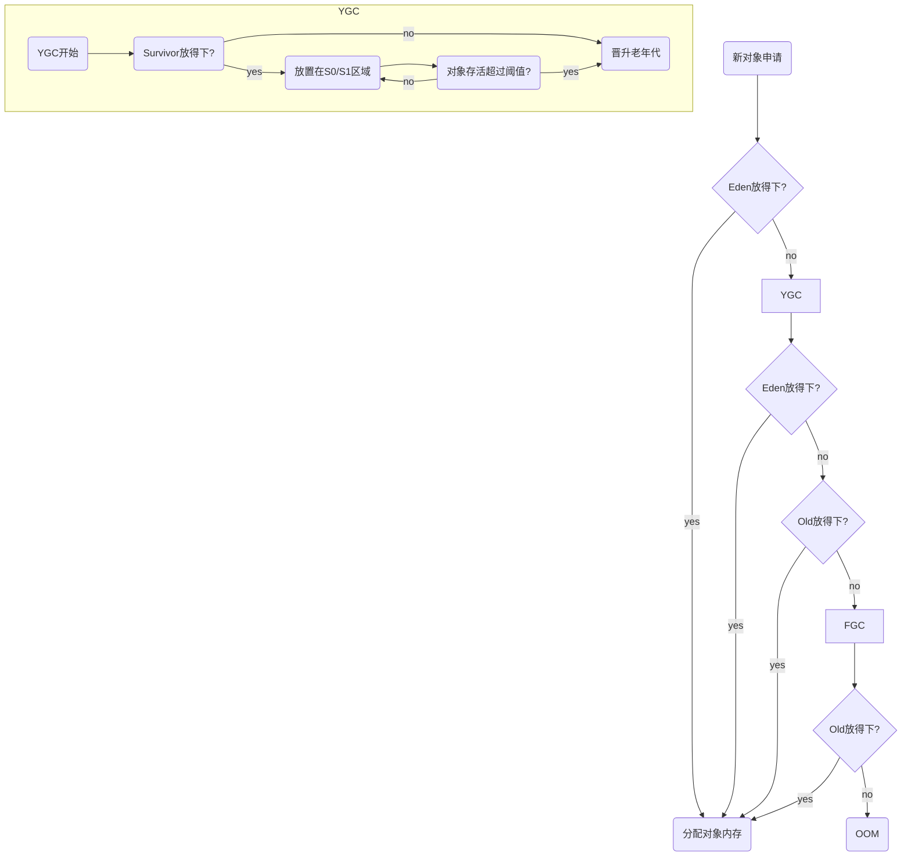

# 08_堆

## 核心概述

1. 一个**JVM实例**只存在**一个堆**，堆是Java内存管理最大的一块核心区域。
2. Java堆区在JVM启动的候即被创建，其空间大小也就确定了，但可以在**创建前调整**大小。
3. 《Java虚拟机规范》规定，堆可以处于**物理上不连续**的内存空间，但**逻辑上连续**。
4. 所有的线程共享Java堆，堆还可以被划分为**线程私有缓冲区**（Thread Local Allocation Buffer, TLAB）。
5. 《Java虚拟机规范》中对Java堆的描述是

   * **从设计初衷来讲**所有的对象实例以及数组都应当在运行时分配到堆上。（The heap is the run-time data area from which memory for **~~all~~** class instances and arrays is allocated）

   * 从实际角度看，这里讲的应当是**几乎（almost）**，对象**可能**出现在栈上。

   * **从设计初衷来讲**，数组和对象可能永远不会存储在栈上，因为栈帧中保存引用，这个引用指向对象或数组**在堆中的位置**。
6. 方法结束后，堆中的对象**不会立即被移除**，仅在垃圾回收的时候才被移除。
7. **堆**是垃圾收集器（Garbage Collector）执行**垃圾回收的重点区域**。

## 年轻代与老年代

> 堆结构划分

* 存储在JVM中的Java对象可以被划分为两类：
  * **生命周期较短**的对象，创建和消亡非常迅速。
  * **生命周期很长**的对象，极端情况下可以与JVM生命周期保持一致。
* Java堆区进一步细分的话，可以划分为**年轻代（YoungGen）**和**老年代（OldGen）**
* 年轻代进一步细分为**伊甸园区(Eden)**，**幸存者0(Suvivor 0)**，**幸存者1(Suvivor 1)**

> 堆结构占比说明

* 新生代比例，默认**-XX:NewRatio=**2，代表**【新生代 : 老年代】 = 1 : 2**
* 幸存者比例，默认**-XX:SurvivorRatio=**8，代表**【幸存者0 : 幸存者1 : 伊甸园】 = 1 : 1 : 8**

> 补充

* 几乎所有Java对象都是在**伊甸园(Eden)**被new出来的。
* 绝大部分Java对象的销毁在**新生代(Young Gen)**进行。
  * IBM公司研究表明，新生代中80%的对象都是“朝生夕死”的。
* **-Xmn** 设置**新生代最大内存**大小。一般默认即可。

## 对象分配过程

### 重要性

1. 内存如何分配，在哪里分配。
2. **内存分配**与**垃圾回收**密切相关，回收后是否产生及如何处理产生**内存碎片**。

### 过程概述

1. new创建的对象放到**伊甸园区**，有大小限制。
2. 伊甸园区满，程序还需对象，则JVM对伊甸园区执行**垃圾回收(Minor GC)**，将不需要的对象销毁，再创建新的对象放伊甸园区。
3. 伊甸园区中的剩余对象移动到**幸存者0区(Survivor 0)**。
4. 再次触发垃圾回收，此时上次幸存下来的**幸存者0区(Survivor 0)**如果未被回收，放到**幸存者1区(Survivor 1)**。
5. 再次触发垃圾回收，重复3和4的过程。
6. 老年代，**默认15次**垃圾回收触发之后的存活对象。
   * **-XXMaxTenuringThreshold=\<N\>**，设置存活移动到老年代的垃圾回收次数。

### 小结

* 针对幸存者S0区和S1区：
  * 复制之后有交换，谁空谁是to；
* 关于垃圾回收，
  * **频繁**在**新生区**收集，
  * **很少**在**老年区**收集，
  * **几乎不**在**永久区/元空间**收集。

### 特殊情况补充

## GC类型的简单梳理

### 涉及范围

JVM在进行GC时，并非每次都对上面的三个内存（**新生代**、**老年代**、**方法区**）一起回收，**大部分时候**回收的都是**新生代**。

### GC类型

Hotspot VM的实现，按回收区域分又分为两种类型：

#### 部分收集

**非完整的Java堆**收集。

1. 新生代收集（Minor GC / Young GC）：收集**Eden区，S0区，S1区**。
2. 老年代收集（Major GC / Old GC）：收集**老年代**。
   * 目前**仅有CMS GC**会有**单独收集**老年代的行为。
   * 很多时候Major GC和Full GC**混合使用**，**需具体分辨**老年代回收还是整堆回收。
3. 混合收集（Mixed GC）：**整个新生代 + 部分老年代**。
   * 目前，仅有G1 GC会有这种行为。

#### 整堆收集

收集**整个Java堆 + 方法区**

## 分代式GC触发条件

### 年轻代GC（Minor GC）触发条件 => **Eden区满**

* **Survivor满不会触发GC**，因为每次MinorGC会清理**年轻代**的内存。

* Java对象**大多是朝生夕灭的**，所以**Minor GC**较**频繁**，且回收**速度较快**。
* Minor GC会引发STW（Stop the World），**暂停用户线程**，回收结束再恢复

### 老年代GC（MajorGC / Full GC）触发机制 => 老年代空间不足

* **经常**会伴随**至少一次MinorGC**（非绝对，在Parallel Scavenge收集器的收集策略中可直接执行Major GC策略）。
  * 老年代空间不足，先尝试触发Minor GC；
  * 若还是不足，再触发Major GC。
* Major GC一般比Minor GC**慢10倍以上**，STW的时间更长。
* Major GC后内存不足，报**OOM异常**。

### Full GC触发机制简述

#### 情况分类

1. 调用System.gc()，**系统建议执行**Full GC，但不必然。
2. **老年代空间**不足。
3. **方法区空间**不足。
4. Minor GC后，进入老年代的平均大小大于老年代可用内存。

5. 由**Eden区 + S0(From Space)区**，**向S1(To Space)区复制**时，对象**大于**To Space可用内存，则把该对象转存到老年代，且老年代可用内存**小于**该对象大小。

#### 说明

**Full GC**是开发或调优种尽量要**避免**的，尽量**减小用户线程挂起时间**。

## 堆空间分代思想

> 为什么要把Java堆分代？不分代就不能正常工作了吗？

* 经研究，不同对象的生命周期不同。**70%~99%**的对象是**临时**对象。
* 不分代完全可以，分代的唯一理由是**优化GC性能**。如果没有分代，那么所有的对象都放一块。

## 内存分配策略

### 整体分配策略

1. 如果对象再Eden出生，并经过第一次Minor GC后任然存活，并且能被Survivor容纳，则对象将被移动到Survivor空间，并且年龄设置为1。
2. 对象在Survivor区**每熬过一次MinorGC**，年龄增加1。
3. 年龄增长到**某个阈值**（Hotspot默认15，有JVM和GC程序差异性），就会被**晋升到老年代(Old Gen)**中。
   * 对象晋升老年代的**年龄阈值**，可以通过选项 -**XX:MaxTenuringThreshold=\<N\>**选项来设置

### 针对不同年龄段的对象分配原则

1. 优先分配到Eden区。
2. 大对象直接分配到老年代。
   * 尽量避免程序中出现过多的大对象。
3. 长期存活的对象分配到老年代。
4. 动态对象年龄判断。
   * 如果Survivor区中**相同年龄的所有对象**大小的总和，大于Survivor空间的一半，年龄**大于或等于该年龄**的对象可以**直接进入老年代**，无需等到MaxTenuringThreshold要求的年龄。
5. 空间分配担保。
   * -XX:HandlePromotionFailure

## 为对象分配内存：TLAB

### 为什么有TLAB（Thread Local Allocation Buffer）？

* **堆**是**线程共享**区域，任何线程都可以访问到堆中的共享数据。
* **对象实例创建**在JVM中非常**频繁**，因此，在**并发环境**下从堆中划分内存空间是不安全的。
* 避免**多线程同时操作**同一地址，使用**加锁等机制**会**影响分配速度**。

### TLAB是什么？

* 从**内存模型角度**，对**Eden区域**继续进行划分，为**每个线程**分配一个私有缓存区域，它包含在Eden空间内。
* 多个线程同时分配内存时候，使用TLAB可以**避免一系列的非线程安全问题**，同时提升内存分配的**吞吐量**，这种策略被称为**快速分配策略**。

* 目前所知的OpenJDK衍生出来的JVM都提供了TLAB设计。

### TLAB再说明

* 尽管不是所有的对象实例都能在TLAB中成功分配，但JVM确实将TLAB设计为**内存分配的首选**。
* 开关设置：**-XX:UseTLAB**

* 内存大小占比设置：**-XX:TLABWasteTargetPercent**。**默认仅1%**。

* 一旦对象**在TLAB内存分配失败**时，JVM就会尝试着通过**加锁机制**确保数据操作的原子性，**在Eden空间分配**内存。