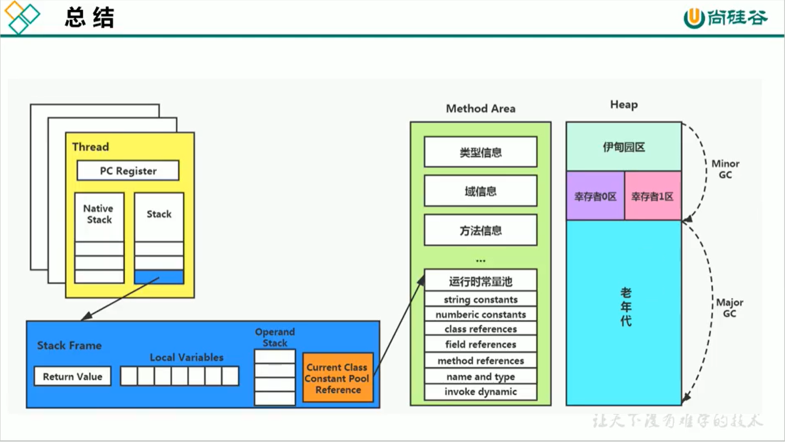
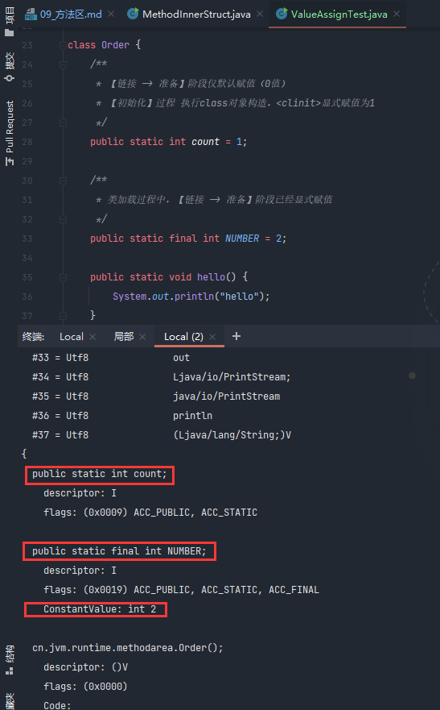
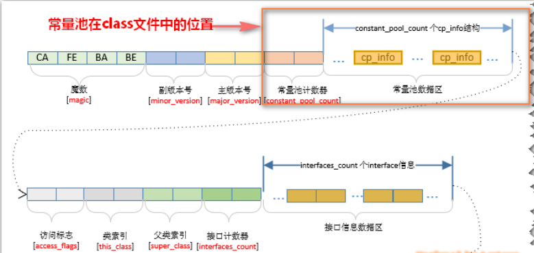
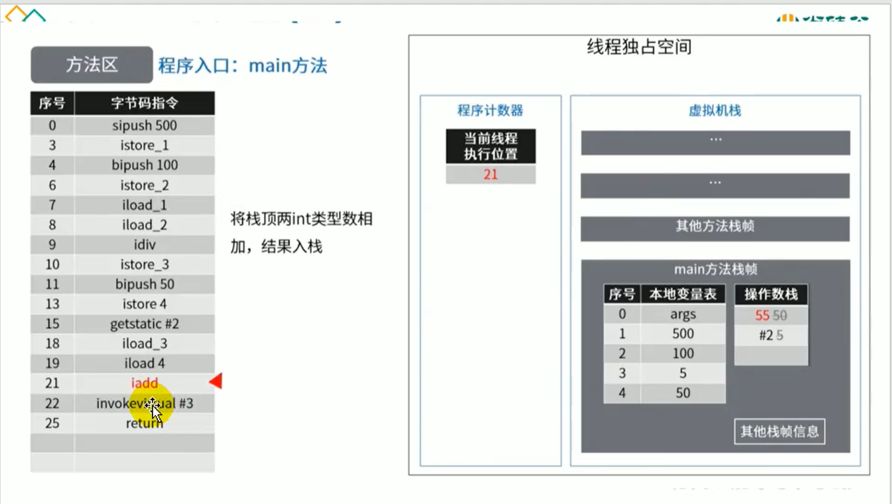

# 09_方法区

## 一、栈、堆、方法区的交互关系

1. 从**线程共享与否**的角度

   ```mermaid
   graph TB
     memory(内存区域) --> thread_share>线程共享]
     memory --> thread_private>线程私有]
     thread_share --> thread_local(ThreadLocal)
     thread_local --> thread_private
    
     thread_share --> heap(堆)
     thread_share --> meta(元空间)
     heap --> oom_hep[OutOfMemoryError: Java heap space]
     meta --> oom_meta[OutOfMemoryError: Metaspace]
    
     overflow_stack[StackOverFlowError]
     thread_private --> java_stack(虚拟机栈) --> overflow_stack
     thread_private --> native_stack(本地方法栈) --> overflow_stack
     thread_private --> pc(程序计数器)
   ```

2. 举例

   
   
   

## 二、方法区的理解

### 1. 基本理解

1. **逻辑上**是堆的一部分；
2. 可选择**不进行垃圾回收或压缩**。
3. 与堆（Heap）一样，**线程共享**，可以**固定大小或可扩展**。
4. 在**JVM启动时**被创建，物理内存可以不连续，**逻辑上连续**。
5. 方法区大小决定了可以保存多少个类信息
   * 内存溢出类型：
     * OutOfMemoryError: PermGen space（JDK 7）
     * OutOfMemoryError: MetaSpace（JDK 8+）
   * 内存溢出举例：
     * 加载大量第三方jar包；
     * Tomcat部署过多工程。
     * 大量动态生成反射类。

## 三、方法区大小与OOM

### 1. 设置方法区内存大小

|              | JDK 7                               | JDK 8                                                        |
| ------------ | ----------------------------------- | ------------------------------------------------------------ |
| 初始内存     | **-XX:PermSize**                    | **-XX:MetaspaceSize**                                        |
|              | 默认20.75M                          | Windows默认21M                                               |
| 最大内存     | **-XX:MaxPermSize**                 | **-XX:MaxMetaspaceSize**                                     |
|              | 32位默认64M，64位默认82M            | Windows默认-1（无限制，但耗尽系统内存也会抛出OOM:Metaspace） |
| 内存溢出信息 | **OutOfMemoryError: PermGen space** | **OutOfMemoryError: Metaspace**                              |
|              |                                     |                                                              |

> 内存大小细节

1. 对**64位服务器JVM**而言，**初始内存默认21M是上限**。一旦超过该值，**Full GC**即会触发，**卸载无用类**（类对应的类加载器将不再存活），**重置上限**。
2. **新的上限值**取决于Full FC释放元空间的大小。
   * 释放空间**不足**，则在**不超过最大值的前提**下适当**提高**。
   * 释放空间**过多**，则**适当降低**。
3. **初始值过低**，则会发生**多次FullGC**（通过垃圾回收器日志可以观察到）。因此建议将初始值设置位一个**相对较高**的值，从而避免多次GC。

### 2. 如何解决这些OOM

一般手段是，首先通过**内存映像分析工具**（如Eclipse Memory Analyzer）对**dump出来的堆转储快照**进行分析，重点是确定内存中的**对象是否是必要**的，即区分**内存泄漏（Memory Leak）**与**内存溢出（Memory Overflow）**

| 异常类型                        | 概念说明                                                     | 处理方式                                                     |
| ------------------------------- | ------------------------------------------------------------ | ------------------------------------------------------------ |
| 内存泄漏（**Memory Leak**）     | 申请的内存**大于系统能够提供**的内存，导致**无法申请足够**的内存 | 用工具查看泄漏对象**到GCRoot引用链**，定位到泄漏代码。       |
| 内存溢出（**Memory Overflow**） | 用完之后却没有被GC回收，**始终占用着内存**                   | 1. 检查**堆参数**-Xms -Xmx；<br>2. 代码检查是否存在**生命周期过长的对象**，进行优化。 |

## 四、方法区内部结构

### 1. 类型

包括**类class**、**接口interface**、**枚举enum**、**注解annotation**的类型

1. **全类名**（包名.类名）
2. **直接父类的全类名**（顶层interface和Object类除外）
3. **修饰符（权限public等、抽象abstract、final）**的某个子集
4. 该类型的**直接接口**的一个**有序列表**

### 2. 域（Field）

必须包含**域信息**，以及**多个域的声明顺序**

1. 名称（变量名）

2. 类型（class等）

3. 域修饰符（以下的某个**子集**）
   * 访问权限**public**
   * 静态**static**
   * 指向不变**final**
   * 禁止指令重排序**volatile**
   * 序列化**transient**

### 3. 方法（Method）

必须包含**方法的以下信息**，以及**多个方法的声明顺序**

1. 方法名
2. 返回类型（return）
3. 入参数量、类型、顺序
4. 方法修饰符（访问权限public）
   * 访问权限**public**
   * 静态**static**
   * 禁止重写**final**
   * 同步**synchronized**
   * 本地**native**
   * 抽象**abstract**
5. 方法字节码（bytecodes）、操作数栈、局部变量表及大小（abstract和native除外）
6. 异常表（abstract和native除外）
   * 每个异常处理的**开始位置**及**结束位置**；
   * 代码处理在**程序计数器中的偏移地址**。
   * 被捕获**异常的常量池索引**。

### 补充

#### 1. 变量初始化时机

1. 代码举例

```java
/**
 * 变量赋值的时机测试<p>&emsp;
 * 1) non-final变量测试<p>&emsp;
 * 2) static final变量测试
 *
 * @author Jinhua
 * @date 2021/4/14 22:40
 */
@SuppressWarnings("all")
public class ValueAssignTest {

    public static void main(String[] args) {
        Order order = null;
        // 类的实例为null，仍然可以访问
        order.hello();
        System.out.println(order.count);
        System.out.println(order.NUMBER);
    }
}

class Order {
    /**
     * 【链接 -> 准备】阶段仅默认赋值（0值）
     * 【初始化】过程 执行class对象构造，<clinit>显式赋值为1
     */
    public static int count = 1;

    /**
     * 类加载过程中，【链接 -> 准备】阶段已经显式赋值
     */
    public static final int NUMBER = 2;

    public static void hello() {
        System.out.println("hello");
    }
}
```

2. 编译结果



3. 小结

   | 变量类型                    | 赋值时机                                                     |
   | --------------------------- | ------------------------------------------------------------ |
   | **non-final变量（static）** | 1. 【链接 -> **准备**】阶段仅**默认赋值**（0值，引用类型null）<br>2. 【**初始化**】过程 执行class对象构造，\<clinit\>**显式赋值** |
   | **static final变量**        | 类加载过程中，【链接 -> 准备】阶段**直接显式赋值**           |

### 4. **常量池**与**运行时常量池**

> **整体关系**

* **字节码**文件 ==> 内部包含**常量池**；
* **方法区** ==> 内部包含**运行时常量池**；
* 要弄清楚方法区，需要理解字节码文件，因为类的信息都加载到方法区。
* 要弄清楚方法区的运行时常量池，需要理解清楚字节码中的常量池。

#### 1. 常量池的概述

1. 包含信息
   * **类的版本**、**字段**、**方法**、**接口**等描述信息
   * **常量池表**
     * 各种字面量
     * 对类型、域、方法的符号引用。

2. 常量池在字节码文件中的位置



3. 为什么需要运行时常量池？

   代码举例如下：

   ```java
   public class SimpleClass {
       public void sayHello {
           System.out.println("hello");
       }
   }
   ```

   * **用到的信息远不止那么多**，虽然该类编译出的类信息很少（194 byte），但里面用到的信息却很多，比如String，System，PrintStream，Object等结构
   * 用常量池作符号引用，在类加载过程【**链接 -> 解析**】时候，将**符号引用转换为直接引用**。

4. 常量池具体内容

   1. 数据类型
      * 数量值
      * 字符串值
      * 类引用
      * 字段引用
      * 方法引用

   例如，以下代码

   ```java
   public class MethodAreaTest2 {
       public static void main(String[] args) {
           Object obj = new Object();
       }
   }
   ```

   第三行 Object obj = new Object();会被编译为

   ```java
   0:		new #2		// Class java/lang/Object
   1:		dup
   2:		invokespecial	#3		// Method java/lang/Object	"<init>"()	V
   ```
   
5. 常量池小结

   **可以看作一张表**，虚拟机指令根据这张表找到要执行的类名、方法名、参数类型、字面量等类型。

#### 2. 运行时常量池概述

1. **创建时机**

   在类和接口加载到方法区后，就会创建运行时常量池。

2. 从属**数量关系**

   每个已加载的类型，都维护一个常量池（**与类型一对一**），通过索引访问。

3. 包含的**多种常量**

   * 编译期间**就已经明确的字面数值量（static final）。

   * **运行时解析**获得的方法或字段的引用（解析为对象的真实地址，不再是符号引用了），反映出**运行时常量池的特征——动态性**。

4. 与传统语言**类比**

   * 类似于传统语言中的**符号表（symbol table）**，但运行时常量池的数据比符号表更丰富。

5. **内存溢出**

   * 运行时常量池**所需内存**空间超过了**方法区最大值设置**，抛出OutOfMemoryError: Metaspace

## 五、方法区使用举例

1. 测试类代码

   ```java
   /**
    * 模拟方法区的使用情况<p>&emsp;
    * 静态方法，除了out对象，未用到堆，目前PPT中暂未展示堆结构变化。
    *
    * @author Jinhua
    * @date 2021/4/15 22:31
    */
   public class MethodAreaTest {
   
       public static void main(String[] args) {
           int x = 500;
           int y = 100;
           int a = x / y;
           int b = 50;
           System.out.println(a + b);
       }
   }
   ```

2. 图示举例

   

## 六、方法区的演进

### 1. 演进细节

#### 1) 版本对比

| JDK 版本          | 方法区主要变化                                               |
| ----------------- | ------------------------------------------------------------ |
| **JDK 1.6及之前** | 有**永久代（Permernent Generation）**，**静态变量**存放于永久代。 |
| **JDK 1.7**       | 永久代**正在逐步去除**，字符串常量池、静态变量移除，保存在堆中。 |
| **JDK 1.8及之后** | 无永久代，类型信息、字段、方法、常量保存于**本地内存元空间**，字符串常量池、静态变量任然在堆中。 |

* 最大区别是，**元空间**不在虚拟机设置的内存中，而**使用本地内存**。

#### 2) 结构简图



* **永久代或元空间**，可以看作是**方法区的实现**。
  * 方法区和永久代，**对于Hotspot虚拟机而言才等价**。对于JRockit / J9虚拟机而言，不存在永久代的概念。
  * 现在看来，当年使用**永久代**不是好的主意，容易导致程序OOM（**超过MaxPermSize上限**）

#### 3) 变更的考虑因素分析

##### 1. 方法区（永久代）使用本地内存（JDK 8）

> 参考网址：[JEP 122: Remove the Permanent Generation](http://openjdk.java.net/jeps/122)

1. **永久代（PermGen）空间大小**是很难确定的。

   某些场景下如果**动态类加载过多**，永久代（PermGen）容易OOM。

2. **永久代调优是很困难的**。

##### 2. String Table的变更（JDK 7）

将String Table移入堆空间中，主要因素是**GC频率**。

* 永久代的回收效率很低，Full GC（老年代空间不足  / 永久代空间不足），才会触发。
* 开发中大量创建字符串，会导致永久代内存不足。放到堆中，能及时回收内存。

##### 3. 静态变量存放位置变更（JDK 7）

从《Java虚拟机规范》定义的概念模型来看，所有**class对象的信息**都应该存放于**方法区**。但**如何实现并未做出规定**，具体虚拟机可不同。

**JDK 7+**的Hotspot虚拟机选择把**静态变量与类型**在Java语言一端的映射class对象存放在一起，**存储于Java堆**。

## 七、方法区的垃圾回收

### 1. 现状

* 《Java虚拟机规范》**并未要求方法区垃圾收集**。
* 回收**效果不好**（尤其是**类卸载，条件苛刻**）。
* **有时确实是有必要**。

### 2. 回收的主要内容

#### 1) 常量池废弃的常量

1. 字面量（文本字符串，被声明final的常量值）
2. 符号引用
   * 类和接口的全限定名
   * 字段名称和描述符
   * 方法的名称和描述符 

#### 2) 不再使用的类

##### 1. 类被废弃的判定条件

1. 该类的**所有实例被回收**
2. 加载该类的**类加载器已经被回收**
   * 这个条件很难达成，除非是经过精心设计的**可替换类加载器的场景**（如OSGI, JSP重加载）。
3. 该类的类对象的**java.lang.Class对象**没有在任何地方被引用。
   * 无法通过反射来访问该类的方法。

##### 2. 相关参数

1. 允许类的回收
   * -Xnoclassgc
2. 信息查看参数
   * -verbose: class
   * -XX:+TraceClass-Loading
   * -XX:+TraceClassUnLoading

##### 3. 相关卸载场景

**动态类加载**（反射、动态代理、CGLib），**频繁定义类加载器**（动态JSP，OSGI），要求Java虚拟机具备**类型卸载的能力**，减小方法区内存压力。

## 八、常见大厂面试题

### 百度

#### 三面

说一下JVM内存模型吧，有哪些区？分别干什么的？

### 蚂蚁金服

* Java 8内存分代改进。
* JVM内存分哪几个区，每个区的作用分别是什么？

#### 一面

* JVM内存分布结构？栈和堆的区别？堆的结构？

#### 二面

* Eden和Survivor的分配比例。

### 小米

* jvm内存分区，为什么要有新生代和老年代？

### 字节跳动

#### 一面

* Java的内存分区。

#### 二面

* 讲讲JVM的运行时数据区。
* 什么时候对象会进入老年代？

### 京东

* JVM的内存结构，Eden和Survivor的比例。
* JVM内存为什么要分成新生代、老年代、永久代？新生代中为什么要分为Eden和Survivor？

### 天猫

#### 一面

* JVM内存模型及分区，需要详细到每个区放什么。

#### 二面

* JVM内存模型，Java 8做了什么修改。

### 拼多多

* JVM内存分哪几个区，每个区的作用是什么？

### 美团

* Java内存分配
* JVM中的永久代会发生垃圾回收吗？
* JVM内存分区，为什么要有新生代和老年代？

## 个人思考（待完善）

1. 堆内存分代思想的设计，主要考虑因素是**对象的生命周期**，个人理解Spring的经久不衰，正是因为Spring容器也是基于对象生命周期管理的考虑。在广泛使用的web + 数据库交互式系统下，**数据库**决定了内存中不需要维持太多对象。对象随着网络请求的发起而创建，除了一些全局配置的对象，其余对象**对于完成自身职责的存在周期**就是方法栈帧的存在时间，JVM方法栈帧弹出，其余大多对象是不需要的状态，被GC算法判断而回收。

