# 10_对象的实例化布局与访问定位

## 一、对象的实例化

### 1. 创建方式

* new
* Class对象的newInstance()
* Constructor的newInstance(args)
* 使用clone
* 使用反序列化ObjectInputStream
* 第三方库Objenesis

### 2. 创建步骤

#### 1) 从字节码角度切入

1. 源代码

   ```java
   /**
    * 从字节码角度分析对象创建过程
    *
    * @author Jinhua
    * @date 2021/4/18 19:51
    */
   public class ObjectCreate {
   
       public static void main(String[] args) {
           Object object = new Object();
       }
   }
   ```

2. main方法对应字节码指令

   ```java
   Code:
         stack=2, locals=2, args_size=1
            0: new           #2                  // class java/lang/Object
            3: dup
            4: invokespecial #1                  // Method java/lang/Object."<init>":()V
            7: astore_1
            8: return
         LineNumberTable:
           line 12: 0
           line 13: 8
         LocalVariableTable:
           Start  Length  Slot  Name   Signature
               0       9     0  args   [Ljava/lang/String;
               8       1     1 object   Ljava/lang/Object;
   ```

#### 2) 实际6个步骤

1. **判断**对象对应的Class类型是否已经被**加载、链接、初始化**
2. 为对象**分配内存**
   * 若内存规整——指针碰撞
   * 若内存不规整——虚拟机需要维护一个列表，空闲列表分配
3. 处理**并发安全**问题
   * 采用CAS配上失败重试，保证更新的原子性
   * 每一个线程预先分配一块TLAB
4. **默认初始化**分配到的空间
   * 所有属性设置默认值，保证对象实例字段在不赋值的情况下可以使用。
5. 设置**对象头**
   * 所属类(Class信息)
   * hashcode
   * GC信息
   * 锁信息等
6. **显式初始化**
   * **属性**显式赋值
   * **构造代码块**赋值
   * **构造方法**赋值

## 二、对象的内存布局

### 1. 对象头（Header）

#### 1) 运行时元数据

* Hash值
* GC分代年龄
* 锁状态标识
* 线程持有的锁
* 偏向线程ID
* 偏向时间戳

#### 2) 类型指针

指向**所属类型class对象的指针**，确定该对象的所属类型。

#### 3) 可能存在的信息（为数组时）

* 如果是**数组**，还需设置**数组长度**（数组也存在于堆，通过new关键字开辟）

### 2. 实例数据（Instance Data）

#### 1) 说明

对象真正存储的**有效信息**，包括程序代码中定义的各种字段（包括**从父类继承**的和**自己拥有**）

#### 2) 规则

1. 相同宽度的字段总是分配到一起；
2. 分类中定义的出现在当前类之前；
3. 如果CompactFields参数为true（默认为true），子类的窄变量可能插入到父类变量的空隙；

### 3. 对齐填充（Padding）

不是必须的，无特殊含义，仅起到占位符作用。

### 代码与图示

1. 示例代码

   * Customer类

     ```java
     public class Customer {
     
         /**
          * 显式赋值
          */
         int id = 1001;
         /**
          * 代码块赋值
          */
         String name;
         /**
          * 构造器赋值
          */
         Account account;
     
         {
             name = "匿名用户";
         }
     
         public Customer() {
             account = new Account();
         }
     }
     
     class Account {
     }
     ```

   * 主方法所在类

     ```java
     public class Main {
         public static void main(String[] args) {
             Customer customer = new Customer();
         }
     }
     ```

2. 图示



## 三、对象的访问定位

### 1. 句柄访问

#### 优势

对于垃圾回收等**对象移动**的情况，**引用变量的指针**不用修改，只需要修改**句柄池中的变量实例指针**。

#### 劣势

需要**额外维护句柄池**。



### 2. 直接指针




## 四、大厂面试题

### 1. 美团

* 对象再JVM中是怎么存储的？
* 对象头信息里面有什么东西？

### 2. 蚂蚁金服

#### 二面

* Java对象头里面有什么？