# 12_执行引擎

## 一、概述

### 1. 地位

   * Java虚拟机**核心组成**部分之一。

### 2. 虚拟机与物理机

   * 【虚拟机】是一个相对于【物理机】的概念，两种机器都有代码执行的能力。

     * 【物理机】的执行引擎，**直接建立于**处理器、缓存、指令集和操作系统层面。
     * 【虚拟机】的执行引擎**由虚拟机程序实现**。可以**不受物理条件制约**地定制指令集与执行引擎结构体系，能执行哪些**不被硬件直接支持的指令集**格式。

### 3. 主要职责

* 将字节码指令解释 / 编译为平台上的本地机器指令。

## 二、Java代码编译和执行过程

### 1. 解释器与JIT编译器

### 1) 解释器

* Java虚拟机中，对字节码采取**逐行解释**，**翻译**为平台机器指令**并执行**的软件模块。

### 2) JIT编译器(Just In Time Compiler)

* 将字节码**编译**为本地**平台相关的机器语言**的软件模块。

### 2. 半编译半解释型语言

* JDK 1.0时代，Java语言定位为**解释执行**的语言。
* 目前的JVM执行Java代码，将**解释执行**和**编译执行**结合起来。

## 三、机器码、指令、汇编语言

### 1. 机器码

* 采用**二进制方式编码**的指令。
* 与CPU硬件紧密相关。
* 与其他类型语言相比，执行速度最快。
* 容易出错，不利于理解和记忆。

### 2. 指令与指令集

#### 1) 指令

* 基于机器码**可读性差的优化**。

* 0和1的不同**序列简化**为指令，如mov、inc等。
* **不同的硬件平台可能不同**。

#### 2) 指令集

* **不同硬件平台**，各自支持的指令有差别。区分为平台指令集。
  * **x86指令集**，对应x86架构平台。
  * **ARM指令集**，对应ARM架构平台。

### 3. 汇编语言

* 基于**指令可读性差的优化**发明。
* 汇编语言中，用**助记符(Mnemonic)**代替机器指令操作码，用**地址符号(symbol)**或**标号(Label)**代替指令或操作数地址。
* **平台 相关性**。在不同硬件平台的汇编语言对应不同的机器语言指令集。

### 4. 字节码

#### 1) 概述

* 一种**中间状态的二进制代码**，比机器码更抽象。需要直译器转译后才能成为机器码。

#### 2) 目的

* 为了实现**特定软件环境和软件运行**，与硬件无关。

#### 3) 实现

通过前端编译器（字节码编译器）和虚拟机器（如JVM）。

* 前端编译器：编译为字节码。
* 虚拟机器： 转译为可以直接执行的指令。

典型应用是**Java bytecode**。

## 四、解释器

### 1. 分类

#### 1)  字节码解释器

   * 纯软件代码模拟字节码执行，效率低下。
#### 2) 模板解释器

   * 每一条字节码**和一个模板函数关联**，模板函数**直接产生**该字节码执行时的机器码，很大程度上提高解释器性能。

### 2. Hotspot VM中的解释器

主要是Interpretor + Code两个模块构成。

#### 1) Interpretor模块

解释器**核心功能**。

#### 2) Code模块

**管理**运行时生成的**机器指令**。

### 3. 现状

* 解释器**实现非常简单**。Java，Perl，Python，Ruby都依赖于解释器。
* **低效**的代名词。
* JVM平台提出**JIT即时编译器**，优化低效的问题。
* 为中间语言的发展做出了贡献。

## 五、JIT编译器

