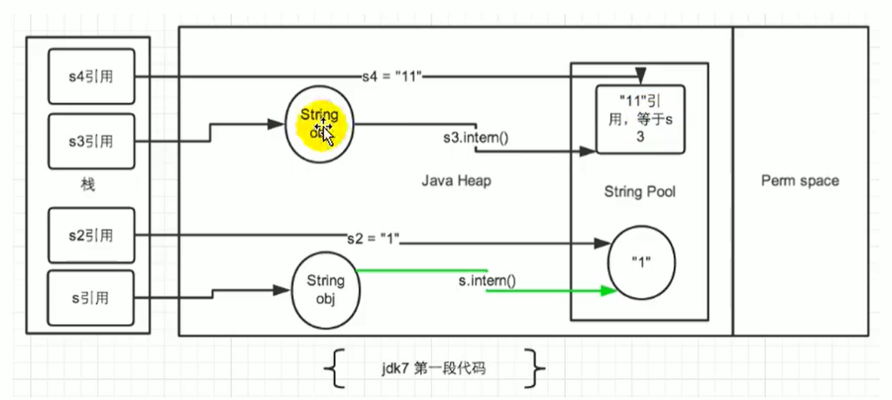

# 13_StringTable

## 一、String的基本特性

### 1. 基本定义

1. 字符串，用引号包含起来。
2. String类被声明为**final**，不可被继承。
3. 类实现了**Serializable**接口，可被序列化。
4. 类实现**Comparable**接口，可以比较大小。

### 2. 版本变更

> 在**JDK 8及以前**内部定义**final char[]**存储字符串数据，在**JDK 9** 时候改为**byte[]**。[JDK 9 String类型变更](http://openjdk.java.net/jeps/254)

1. 驱动因素：
   * Data gathered from many different applications indicates that strings are a major component of heap usage and, moreover, that most `String` objects contain only Latin-1 characters. Such characters require only one byte of storage, hence half of the space in the internal `char` arrays of such `String` objects is going unused.
   * 从许多不同的应用程序收集的数据表明，字符串是**堆使用的主要组成部分**，而且，**大多数String对象仅包含Latin-1字符**。 这样的字符**仅需要一个字节**的存储空间，因此此类String对象的内部char数组中的一半空间都未使用。
2. 描述
   * We propose to change the internal representation of the `String` class from a UTF-16 `char` array to a `byte` array plus an encoding-flag field. The new `String` class will store characters encoded either as ISO-8859-1/Latin-1 (one byte per character), or as UTF-16 (two bytes per character), based upon the contents of the string. The encoding flag will indicate which encoding is used.
   * 我们建议将String类的内部表示形式从**UTF-16字符数组**更改为**字节数组**，再加上一个**编码标志字段**。 新的String类将存储基于字符串内容编码为ISO-8859-1 / Latin-1（每个字符一个字节）或UTF-16（每个字符两个字节）的字符。 编码标志将指示使用哪种编码。

#### 1) JDK 8

```java
public final class String
    implements java.io.Serializable, Comparable<String>, CharSequence {
    /** The value is used for character storage. */
    private final char value[];
}
```

#### 2) JDK 9 +

```java
public final class String implements Serializable, Comparable<String>, CharSequence {
    @Stable
    private final byte[] value;
    private final byte coder;
}
```

### 3. String Pool底层实现 => HashTable

> 字符串常量池中是不回存储两个相同内容的字符串的。

* **字符串常量池String Pool**是一个**固定大小的HashTable**。如果放进String Pool的String非常多，会造成**Hash冲突**严重，链表会很长。导致String.intern时，性能大幅度下降。

  * 常量池大小设置，VM参数，最大值为2305843009213693951

     -XX:StringTableSize

  * JDK 6，大小默认1009，无下限。

  * JDK 7，大小默认60013，无下限。

  * JDK 8中，1009是可设置的下限。

## 二、String的内存分配

> 8种基本数据类型和特殊的类型String，都提供了**常量池**的概念，使得运行时更快，更节省内存。

### 1. 概述

* 常量池可理解为**Java系统级别的缓存**，8种基本数据类型是系统协调的。String类型的常量池比较特殊，主要使用方法有两种。

  ```java
  public class Main {
      String str1 = "abc";
      String str2 = new String("Hello");
  }
  
  * 直接使用双引号定义；
  * 不适用双引号声明的，可以使用String.intern方法。

### 2. 内存分配


#### 1) 变更描述

1. **JDK 6及以前**
   * 存放于**永久代**。

2. **JDK 7**
   * 字符串常量池的位置调整到Java堆内。
     * 方便调优，仅需要调整堆的大小。
     * 重新考虑在Java 7中使用String.intern()

3. JDK 8+
   * 存放于**堆**。

#### 2) String Table调整动机

[StringTable调整动机](https://www.oracle.com/technetwork/java/javase/jdk7-relnotes-418459.html#jdk7changes)

主要原因总结：

1. permSize默认比较小；
2. 永久代垃圾回收频率低；

## 三、String的基本操作

### 1. 字符串常量池，不存放两个完全相同的字符串实例

* Java语言规范里，要求**完全相同的字符串**字面量，应该包含相同的Unicode字符串序列，并且**指向同一个String类的实例**。

  ```java
  /**
   * 字符串常量池测试，不存放两个完全相同的实例<p>&emsp;
   * 通过断点调试，查看memory中的字符串常量个数
   *
   * @author Jinhua
   * @version 1.0
   * @date 2021/4/27 17:02
   */
  public class StringPoolTest {
      public static void main(String[] args) {
          // 2980
          System.out.println("1");
          // 2981
          System.out.println("2");
          // 2982
          System.out.println("3");
  
          // 2983
          System.out.println("1");
          System.out.println("2");
          // 2983
          System.out.println("3");
      }
  }
  ```

  ### 2. Java Runtime Memory

  

```java
public class MemoryTest {

    @SuppressWarnings("all")
    public static void main(String[] args) {// line 1
        int i = 1;  // line 2
        Object obj = new Object();  // line 3
        MemoryTest mTest = new MemoryTest(); // line 4
        mTest.foo(obj);
    }   // line 5

    @SuppressWarnings("all")
    private void foo(Object obj) { // line 6
        String str = obj.toString();    // line 7
        System.out.println(str);
    }   // line 8
}
```

## 四、字符串的拼接操作

```java
public class Main {
      /**
     * StringBuilder和String的拼接执行效率，for循环测试<p>&emsp;
     * 1) append()方式，自始至终只会创建一个StringBuilder对象；<p>&emsp;
     * 2) String拼接方式，创建多个StringBuilder对象，及多个String对象，占用内存对象。每次循环，进来的变量，下一次就不再使用。<p><p>
     * 改进空间：
     * 1) 若基本确定长度上限，则建议使用指定容量构造器{@link StringBuilder#StringBuilder(int)}，以减小扩容
     */
    @Test
    public void test4() {
        StopWatch sw1 = new StopWatch();
        sw1.start();
        method1(100_000);
        sw1.stop();
        // 9500ms
        System.out.println("花费时间：" + sw1.getTotalTimeMillis());

        StopWatch sw2 = new StopWatch();
        sw2.start();
        method2(100_000);
        sw2.stop();
        // 2ms
        System.out.println("花费时间：" + sw2.getTotalTimeMillis());
    }

    private void method1(int highLevel) {
        String src = "";
        for (int i = 0; i < highLevel; i++) {
            // 创建10w个StringBuilder，及10w个String
            src += "a";
        }
    }

    private void method2(int highLevel) {
        StringBuilder sb = new StringBuilder();
        for (int i = 0; i < highLevel; i++) {
            sb.append("a");
        }
    }
}
```

### 1. 字符串拼接的方式

1. StringBuilder
   * 循环中，自始至终只会创建一个StringBuilder对象；
2. String与【+】连接
   * 循环中，创建多个StringBuilder对象，及多个String对象，占用内存对象。
   * 每次循环，进来的变量，下一次就不再使用。

### 2. StringBuilder改进空间

若基本确定长度上限，则建议使用指定容量构造器**StringBuilder.StringBuilder(int)**，以减小扩容。

### 3. 一个面试题

* 以下两个语句分别创建了几个对象？
  * String str1 = new String("ab"); 
  * String str2 = new String("a") + new String("b");

> 解答：
>
> 1. new String("ab") 创建了几个对象？
>    2个：
>    ① new关键字在堆空间创建的对象；
>    ② 字符串常量池中的对象，字节码指令ldc。
>
> 2. new String("a") + new String("b")创建了几个对象？
>    6个：
>    ① 【+】拼接，new StringBuilder();
>    ② new String("a");
>    ③ 常量池中的 “a”。
>    ② new String("b");
>    ③ 常量池中的 “b”。
>
>   深入剖析：
>   ⑥ StringBuilder#toString();

## 五、intern() 的使用

### 1. 使用规则

* 如果**不是双引号声明**的String对象，可以使用 intern()方法。查询当前字符串是否存在，若不存在则将当前字符串放入常量池中。

  ```java
  public class Main {
      public static void main(String[] args) {
          String myInfo = new String("Hello, world!").intern();
      }
  }
  ```

* 换句话说，在任意字符串常量调用intern()方法，返回结果所指向的那个实例，必须和直接以常量形式出现的字符串实例完全相同。

  ```java
  public class Main {
      public static void main(String[] args) {
          // 值为true
          boolean equals = ("a" + "b" + "c").intern() == "abc";
      }
  }
  ```

* 通俗讲，Intern**保证**字符串在**内存只有一份**，以节约空间，加快字符串操作速度。这个值会被存放在**字符串内部池(String Intern Pool)**。

### 2. 小结

1. 如何保证变量s指向的是字符串常量池中的数据，而不是堆内存中new的数据呢？
   1. 字面量

      String s = “hello”;

   2. 调用intern方法

      String s = new String(“hello”).intern();

2. intern的使用规则概括：
   * JDK 6：
     * 将字符串复制一份
   * JDK 7+：
     * 将字符串的引用地址复制一份

### 3. 面试题

1. 以下代码的输出结果是什么？

   ```java
   public class Main {
       /**
        * intern的使用，不同版本结果不同（JDK 7将字符串常量池移至堆空间）<p>&emsp;
        * 1) JDK 6及以前；
        * 2) JDK 7+：
        */
       @SuppressWarnings("all")
       public static void main(String[] args) {
           String s1 = new String("1");
           // 调用intern方法前，字符串常量池和堆空间中都存在了"1"
           s1.intern();
           String s2 = "1";
           // JDK 6 -> false
           // JDK 7+ -> false
           System.out.println(s1 == s2);
   
           // s3 指向 new String("11")，执行完后字符串常量池中不存在"11"
           String s3 = new String("1") + new String("1");
           // 字符串常量池中生成"11"
           // 在JDK 6中，创建一个新的对象"11"；
           // 在JDK 7+中，
           s3.intern();
           // s4 指向 上一行代码生成的字符串常量池中"11"的地址
           String s4 = "11";
           // JDK 6 -> false
           // jDK 7+ -> true
           System.out.println(s3 == s4);
       }
   }
   ```

   * 详细解读

     

2. 将以上的s3的intern和s4的定义两个语句互换顺序。

   ```java
   public class Main {
       public static void main(String[] args) {
           String s3 = new String("1") + new String("1");
           String s4 = "11";
           String s5 = s3.intern();
           System.out.println(s3 == s4);	// flase
           System.out.println(s4 == s5);	// true
       }
   }
   ```

   * 关键点：**intern时**，字符串常量池中**是否有"11"**

3. 扩展练习1

   ```java
   public class Main {
       public static void main(String[] args) {
           String  s = new String("a") + new String("b");
           String s2 = s.intern();
           // JDK 6 -> true;	JDK 8 -> true
           System.out.println(s2 == "ab");
           // JDK 6 -> false;	JDK 8 -> true（常量池创建的是引用）
           System.out.println(s == "ab");
       }
   }
   ```

   * 关键点：**字符串常量池中创建的**字符串是**副本还是引用**。

4. 扩展练习2

   ```java
   public class Main {
       public static void main(String[] args) {
           String s1 = new String("ab");
           String s1 = new String("a") + new String("b");
           s1.intern();
           String s2 = "ab";
           System.out.println(s1 == s2);
       }
   }
   ```

   * 关键点：s1的两种创建方式，**字符串常量池中是否有"ab"**

5. 效率测试

   ```java
   /**
    * String的intern方法空间使用上的效率测试
    * <p>
    * 替换for循环中的语句，通过JVisual VM查看intern的影响
    *
    * @author Jinhua
    * @version 1.0
    * @date 2021/4/28 10:52
    */
   public class StringInternEff {
       static final int MAX_COUNT = 1_000 * 10_000;
       static final String[] ARRAYS = new String[MAX_COUNT];
   
       @SneakyThrows
       @SuppressWarnings("all")
       public static void main(String[] args) {
           Integer[] data = new Integer[]{1, 2, 3, 4, 5, 6, 7, 8, 9, 10};
   
           StopWatch sw = new StopWatch();
           sw.start();
           for (int i = 0; i < MAX_COUNT; i++) {
   //            ARRAYS[i] = new String(String.valueOf(data[i % data.length]));
               ARRAYS[i] = new String(String.valueOf(data[i % data.length])).intern();
           }
           sw.stop();
           System.out.println("花费时间：" + sw.getTotalTimeMillis());
   
           Thread.sleep(1_000_000L);
           System.gc();
       }
   }
   ```

   

## 六、StringTable的垃圾回收

```java
/**
 * String的垃圾回收测试<p>&emsp;
 * -Xms15M -Xmx15M -XX:+PrintStringTableStatistics -XX:+PrintGCDetails
 *
 * @author Jinhua
 * @version 1.0
 * @date 2021/4/28 11:13
 */
public class StringGc {

    @SuppressWarnings("all")
    public static void main(String[] args) {
        // 通过调整num值，查看对象个数
        int num = 100;
        for (int i = 0; i < num; i++) {
            String.valueOf(i).intern();
        }
    }
}
```

* 通过调大num值，发现不是按预期的线性增长，说明存在垃圾回收行为。

## 七、G1中的String去重操作

### 1. 操作概述

[G1的String去重操作](https://openjdk.java.net/jeps/192)

#### 1) 前提说明

* 去重是指去除**new的char[]数组**的重复，而不是常量池中的重复。

#### 2) 测试结果及分析

1. 测试结果
   * 堆存活数据集合里，String对象占了25%；
   * 重复的对象占13.5%；
   * String对象平均长度是45

2. 结果分析
   * 许多大规模Java应用的瓶颈在于内存，堆上存在重复的String对象必然是一种浪费。

#### 3) 实现细节

1. GC工作时，会访问堆上存活的对象。对每个访问到的对象都检查，是否为**候选的要去重的String对象**

   * 如果是，将**对象的引用**插入到**队列**中等待后续处理。一个**去重线程**在后台运行，处理这个队列，从队列中删除元素，然后尝试**去重它引用的String对象**。

2. 使用一个Hashtable记录所有被String对象使用的不重复的char数组。去重时候，查询该Hashtable，看堆上是否有相同的char数组。

   * 如果存在，String对象会被调整到引用那一个数组，释放对原有数组的引用。最终会被垃圾收集器回收掉。

   * 如果查找失败，char数组会被插入到Hashtable，以后如果有需要该引用时候，就共享该数组了。

#### 4) VM参数

| 参数                                        | 描述                                                         |
| ------------------------------------------- | ------------------------------------------------------------ |
| **-XX:+UseStringDeduplication**             | **开启String去重**，默认关闭。                               |
| **-XX:+PrintStringDeduplicationStatistics** | 打印详细的**去重统计信息**                                   |
| **-XX:StringDeduplicationAgeThreshold=5**   | **年龄阈值**，达到该年龄的String对象被认为是去重的候选对象。 |

