# 13_StringTable

## 一、String的基本特性

### 1. 基本定义

1. 字符串，用引号包含起来。
2. String类被声明为**final**，不可被继承。
3. 类实现了**Serializable**接口，可被序列化。
4. 类实现**Comparable**接口，可以比较大小。

### 2. 版本变更

> 在**JDK 8及以前**内部定义**final char[]**存储字符串数据，在**JDK 9** 时候改为**byte[]**。[JDK 9 String类型变更](http://openjdk.java.net/jeps/254)

1. 驱动因素：
   * Data gathered from many different applications indicates that strings are a major component of heap usage and, moreover, that most `String` objects contain only Latin-1 characters. Such characters require only one byte of storage, hence half of the space in the internal `char` arrays of such `String` objects is going unused.
   * 从许多不同的应用程序收集的数据表明，字符串是**堆使用的主要组成部分**，而且，**大多数String对象仅包含Latin-1字符**。 这样的字符**仅需要一个字节**的存储空间，因此此类String对象的内部char数组中的一半空间都未使用。
2. 描述
   * We propose to change the internal representation of the `String` class from a UTF-16 `char` array to a `byte` array plus an encoding-flag field. The new `String` class will store characters encoded either as ISO-8859-1/Latin-1 (one byte per character), or as UTF-16 (two bytes per character), based upon the contents of the string. The encoding flag will indicate which encoding is used.
   * 我们建议将String类的内部表示形式从**UTF-16字符数组**更改为**字节数组**，再加上一个**编码标志字段**。 新的String类将存储基于字符串内容编码为ISO-8859-1 / Latin-1（每个字符一个字节）或UTF-16（每个字符两个字节）的字符。 编码标志将指示使用哪种编码。

#### 1) JDK 8

```java
public final class String
    implements java.io.Serializable, Comparable<String>, CharSequence {
    /** The value is used for character storage. */
    private final char value[];
}
```

#### 2) JDK 9 +

```java
public final class String implements Serializable, Comparable<String>, CharSequence {
    @Stable
    private final byte[] value;
    private final byte coder;
}
```

### 3. String Pool底层实现 => HashTable

> 字符串常量池中是不回存储两个相同内容的字符串的。

* **字符串常量池String Pool**是一个**固定大小的HashTable**。如果放进String Pool的String非常多，会造成**Hash冲突**严重，链表会很长。导致String.intern时，性能大幅度下降。

  * 常量池大小设置，VM参数，最大值为2305843009213693951

     -XX:StringTableSize

  * JDK 6，大小默认1009，无下限。

  * JDK 7，大小默认60013，无下限。

  * JDK 8中，1009是可设置的下限。

## 二、String的内存分配

> 8种基本数据类型和特殊的类型String，都提供了**常量池**的概念，使得运行时更快，更节省内存。

### 1. 概述

* 常量池可理解为**Java系统级别的缓存**，8种基本数据类型是系统协调的。String类型的常量池比较特殊，主要使用方法有两种。

  ```java
  public class Main {
      String str1 = "abc";
      String str2 = new String("Hello");
  }
  
  * 直接使用双引号定义；
  * 不适用双引号声明的，可以使用String.intern方法。

### 2. 内存分配



#### 1) 变更描述

1. **JDK 6及以前**
   * 存放于**永久代**。

2. **JDK 7**
   * 字符串常量池的位置调整到Java堆内。
     * 方便调优，仅需要调整堆的大小。
     * 重新考虑在Java 7中使用String.intern()

3. JDK 8+
   * 存放于**堆**。

#### 2) String Table调整动机

[StringTable调整动机](https://www.oracle.com/technetwork/java/javase/jdk7-relnotes-418459.html#jdk7changes)

主要原因总结：

1. permSize默认比较小；
2. 永久代垃圾回收频率低；

## 三、String的基本操作

### 1. 字符串常量池，不存放两个完全相同的字符串实例

* Java语言规范里，要求**完全相同的字符串**字面量，应该包含相同的Unicode字符串序列，并且**指向同一个String类的实例**。

  ```java
  /**
   * 字符串常量池测试，不存放两个完全相同的实例<p>&emsp;
   * 通过断点调试，查看memory中的字符串常量个数
   *
   * @author Jinhua
   * @version 1.0
   * @date 2021/4/27 17:02
   */
  public class StringPoolTest {
      public static void main(String[] args) {
          // 2980
          System.out.println("1");
          // 2981
          System.out.println("2");
          // 2982
          System.out.println("3");
  
          // 2983
          System.out.println("1");
          System.out.println("2");
          // 2983
          System.out.println("3");
      }
  }
  ```

  ### 2. Java Runtime Memory

  

```java
public class MemoryTest {

    @SuppressWarnings("all")
    public static void main(String[] args) {// line 1
        int i = 1;  // line 2
        Object obj = new Object();  // line 3
        MemoryTest mTest = new MemoryTest(); // line 4
        mTest.foo(obj);
    }   // line 5

    @SuppressWarnings("all")
    private void foo(Object obj) { // line 6
        String str = obj.toString();    // line 7
        System.out.println(str);
    }   // line 8
}
```

## 四、字符串的拼接操作

## 五、intern() 的使用

## 六、StringTable的垃圾回收

## 七、G1中的String去重操作

