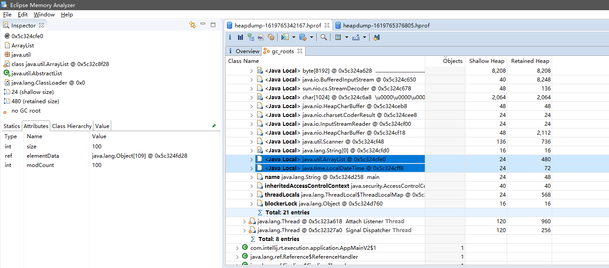
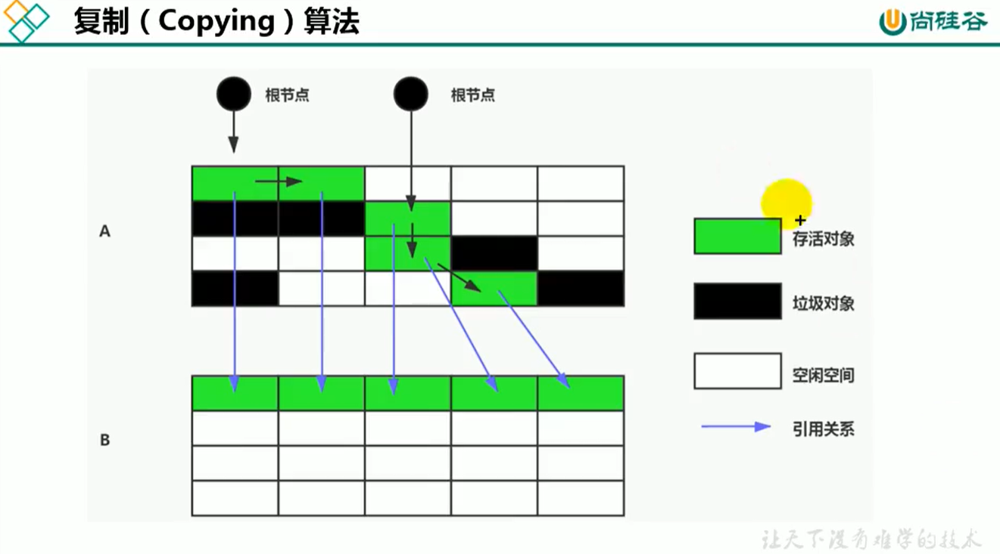

# 15_垃圾回收相关算法

> 对象存活判断

当一个对象不再被**任何已存活的对象**引用时，对象被视为已死亡。

## 一、标记阶段：引用计数算法

### 1. 思路概述

* 每个对象保存一个**整形的引用计数器**属性。

  * 对A对象**增加引用**时，将A的引用计数器**值+1**；
  * **引用失效**时，引用计数器**值-1**；
  * 当对象引用**计数器值为0**时，表示对象A不可能再被使用，**可进行回收**。

### 2. 优势

1. 实现简单，垃圾对象便于辨识；
2. 判定效率高，回收没有延迟性。

### 3. 劣势

1. 存储空间开销
   * 需要单独的**字段存储计数器值**。

2. 时间开销
   * 每次赋值都需要**更新计数器**，伴随加法和减法操作。
   
3. **无法处理循环引用**

   * Java中有循环引用的情况，该算法无法解决，所以没有采用该算法。
   * 补充：Python解决循环依赖方案。
     * 手动解除：合适的时机，将引用计数器手动置为0；
     * 弱引用（weakref）：Python提供标准库。
   * 举例：**单循环链表**。

   ```java
   /**
    * 循环引用问题探究<p>&emsp;
    * -XX:+PrintGCDetails <p><p>
    * 操作：打开或关闭{@link System#gc()} 方法；<p>
    * 结果：GC信息，内存占用不同；<p>
    * 结论：Java未使用引用计数算法；<p>
    *
    * @author Jinhua
    * @version 1.0
    * @date 2021/4/29 21:04
    */
   public class RefCountGc {
       /**
        * 唯一作用：占内存
        */
       private final byte[] bigSize = new byte[5 * 2024 * 1024];
   
       RefCountGc reference = null;
   
       public static void main(String[] args) {
           RefCountGc r1 = new RefCountGc();
           RefCountGc r2 = new RefCountGc();
   
           // 互相引用
           r1.reference = r2;
           r2.reference = r1;
           // 释放外部引用
           r1 = null;
           r2 = null;
           // 打开或关闭gc方法，观察是否会执行GC
           System.gc();
       }
   }
   ```

## 二、标记阶段：可达性分析算法

### 1. 别名

* 根搜索算法
* 追踪性垃圾收集

### 2. 特点

* 简单高效**；

* 有效**解决循环引用**问题，防止内存泄漏。

### 3. 根对象集合（GC Roots）

#### 1) 约束定义

* 一组**必须活跃的引用**。

#### 2) 主要GC Roots

1. **虚拟机栈（Java Stack）**中的引用对象。
2. **本地方法栈（Native Method Stack）**内的**JNI引用**的对象。

3. 方法区**静态属性**引用的对象。
4. 被同步锁**synchronized**持有的对象。
5. **JVM内部的引用**。
   * 基本数据类型对应的Class对象。
   * 常驻的异常对象。
   * 系统类加载器。
6. 反映**JVM内部情况的对象**。如JMXBean，JVMIT中注册的回调，本地代码缓存等。

#### 3) 其他GC Roots

除了上述固定的GC Roots外，根据用户所选用的垃圾收集器以及当前回收的内存区域不同，其他对象引用可临时加入GC Roots。比如**分代收集**和**局部回收（Partial GC）**。

* 如果只针对堆空间某一块区域GC（比如Young区），必须考虑内存区域是虚拟机是自己的实现细节，而不是内存封闭的，**这个区域的对象可能被其他区域的对象所引用**，必须将关联区域的对象一并加入GC Roots集合中。

#### 4) 小技巧

Root采用栈方式存放变量和指针， 如果是一个指针，**保存了堆内存里面的对象，自己又不在堆内存**，则它应该被包含于GC Roots。

### 4. 思路概述

1. 以**根对象集合（GC Roots）**为起始点，按**自顶向下方法搜索**所连接目标**是否可达**。
2. 经过可达性分析后，**存活对象**都会被**根对象直接或间接关联**，搜索走过的路径称为**引用链（Reference Chain）**。
3. 目标对象**没有任何引用链相连**，则是不可达的，意味着对象已经死亡可被回收。

### 5. 一致性

* 分析工作中需要保证**引用关系在一个快照中进行**，才能保证分析结果准确性。
* 所以，GC进行时会**停止用户线程**，以保证一致性。
  * 即使是号称几乎不发生停顿的CMS收集器，枚举根节点也是必须要停顿的。

## 三、对象的finalization机制

> 方法原型

```java
public class Object {
    protected void finalize() throws Throwable {
    }
}
```

### 1. 作用

提供对象**被销毁之前自定义处理**逻辑。

* **套接字**关闭。
* **文件**关闭。
* **数据库连接**关闭。

### 2. 说明

1. 不要主动调用该方法。

* 可能**导致对象复活**；
* 方法**执行时机无保障**，完全由GC线程决定。
* 糟糕的重写finalize()会严重影响**GC的性能**。

2. 功能上来讲，finalize()方法与**C++的析构函数**比较相似。但Java中是基于GC的自动内存管理机制，本质上有不同。

### 3. 对象的状态

* finalize() 方法的存在，导致JVM的**对象处于三种可能的状态**。从根节点开始进行可达性分析，一个无法触及的对象可能在某一个条件下复活自己：
  1. **可触及**的。

  * 经过可达性分析可以找到该对象。

  2. **可复活**的。

  * 对象的所有引用都被释放，但是对象有可能在finalize中复活。

  3. **不可触及**的。

  * 对象的finalize()方法被调用，**并且没有复活**，则进入不可触及状态。
  * 不可触及的对象不可能被复活，因为**finalize()方法只会被调用一次**。
* 对象仅在**不可触及状态**时候才能被回收。

### 4. 代码演示

```java
/**
 * GC过程，可复活对象的演示<p>
 *
 * @author Jinhua
 * @version 1.0
 * @date 2021/4/30 14:18
 */
public class CanReliveObj {

    public static CanReliveObj obj;

    @Override
    protected void finalize() throws Throwable {
        super.finalize();
        System.out.println("调用当前类的finalize() 方法");
        obj = this;
    }

    @SneakyThrows
    public static void main(String[] args) {
        obj = new CanReliveObj();

        // 第一次自救
        obj = null;
        System.gc();
        System.out.println("第一次GC完成！");
        // finalizer优先级低，暂停一下
        Thread.sleep(2_000L);
        String result = Objects.nonNull(obj) ? "第一次自救成功！" : "第一次自救失败...";
        System.out.println(result);

        // 第二次自救
        obj = null;
        System.gc();
        System.out.println("第二次GC完成！");
        // finalizer优先级低，暂停一下
        Thread.sleep(2_000L);
        result = Objects.nonNull(obj) ? "第二次自救成功！" : "第二次自救失败...";
        System.out.println(result);
    }
}
```

## 四、MAT与JProfiler的GC Roots溯源

### 1. MAT查看Gc Roots



### 2. JProfiler查看Gc Roots


> 举例：OOM时候生成dump文件并查看

```java
/**
 * 堆内存溢出生成dump文件<p>&emsp;
 * -Xms8M -Xmx8M -XX:+HeapDumpOnOutOfMemoryError
 *
 * @author Jinhua
 * @version 1.0
 * @date 2021/4/30 15:34
 */
public class HeapOom {

    private final byte[] bytes = new byte[1024 * 1024];

    @SuppressWarnings("all")
    public static void main(String[] args) {
        List<HeapOom> oList = new ArrayList<>();

        int count = 0;
        try {
            while (true) {
                oList.add(new HeapOom());
                count++;
            }
            // oom发生时，会在当前工程的目录下生成dump文件
        } catch (Throwable ex) {
            System.out.println("count = " + count);
            ex.printStackTrace();
        }
    }
}
```

## 五、清除阶段：标记-清除（Mark-Sweep）算法

### 1. 背景

**标记-清除（Mark-Sweep）**

* 非常基础和常见的垃圾收集算法。
* 在1960年被J.McCarthy等人提出并应用于Lisp语言。

### 2. 执行过程

当堆中**有效内存空间（Availble memory）将被耗尽**的时候，就会停止整个程序（Stop the world）（即是**停止用户线程**），然后进行两项工作：

1. **标记**

* Collector从引用根节点开始遍历，标记所有被引用对象，一般是在对象头中记录为**可达**的对象。

2. **清除**

* Collector对**堆内存**进行**线性遍历**，如果发现某个对象在其Header中没有标记为可达对象，则将其回收。

> 注意，这里的清除并不是真的置空，而是把**垃圾对象地址**保存为**列表**。需要分配的时候，再**判断空间是否充足**，并直接**覆盖**。

### 3. 优劣分析

#### 1) 优点

* 常见，易于理解；

#### 2) 缺点

* **效率不算高**。
* **用户体验差**。GC时候停止用户线程。
* **内存碎片**。仅做了清除，未整理内存空间。

## 六、清除阶段：复制算法

### 1. 核心思想

* 将**空间分为两份**，每次只使用其中一份。
* 垃圾回收时候，将正在使用中的内存中的**活对象复制**到未被使用的内存块中，完成复制后，清除正在使用的内存块中的所有对象，**交换两个内存的角色**，完成垃圾回收。



### 2. 优劣分析

#### 1) 优势

* **无标记和清除过程**，实现简单，运行高效。
* 复制后**保证空间连续性**，不会出现碎片空间。

#### 2) 劣势

* 需要**两倍的内存空间**。
* 对于G1这种，拆分成大量region的GC，**复制而不是移动**，意味着GC**需要维护region之间的对象引用关系**。不论是**内存占用**或是**时间开销**都不小。

#### 3) 适用场景

鉴于**复制是耗时的操作**，应该较少进行，系统中的**存活对象占比应该很低**才行。

* **新生代**中，一次通常可以回收70%~99%的空间，回收的性价比高。

## 七、清除阶段：标记-压缩算法

### 1. 背景

* 老年代**存活对象占比高**，**不适用复制算法**。
* 老年代不适用【标记-清除】算法，效率低，产生碎片空间。
* **改进【标记-清除】算法**，产生【标记-压缩算法】。

## 八、清除算法小结

## 九、分代收集算法

## 十、增量收集算法、分区算法

