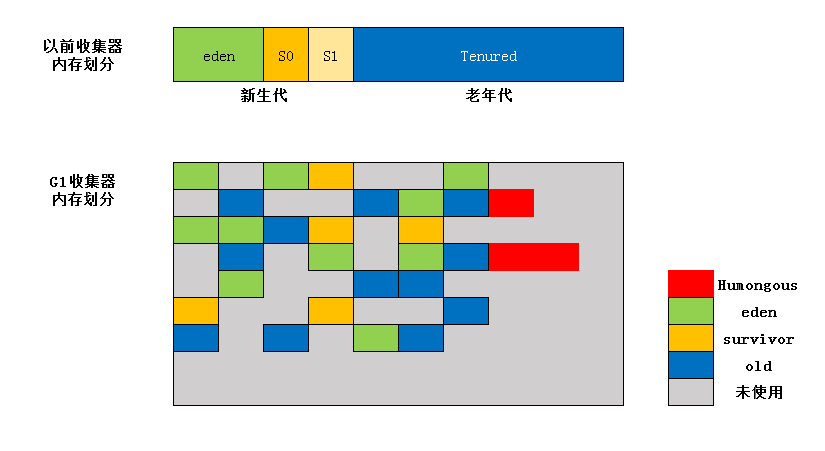
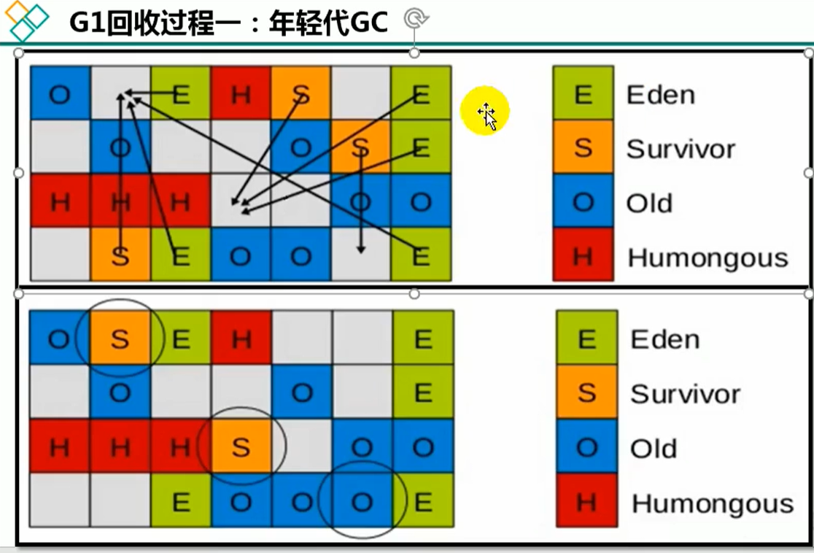

# 17_垃圾回收器

## 一、GC分类与性能指标

* 不同厂商、不同版本的JVM可有自己的实现。
* 不同角度有不同分类。

> Java不同版本的新特性

1. 语法层面：

   Lambda，switch，自动装箱、拆箱、enum、泛型。

2. API层面：Stream API，新的日期时间，Optional，String，集合框架

3. 底层优化：

   JVM的GC变化、元空间、静态域、字符串常量池等。

### 1. 分类

#### 1) 按线程数分

* **串行**垃圾回收器
  * 适用于单核或较小内存等**资源受限的场景**。
* **并行**垃圾回收器
  * 适用于**并发能力较强**的CPU。
  * 并行使得**多个CPU同时执行**，提升了应用的吞吐量。
  * 仍然采用**独占式的STW机制**。

#### 2)按工作模式分

* **并发式**
  * GC线程与用户线程**交替工作**；
  * 尽可能减少用户线程停顿时间。
* **独占式**
  * GC时候**停止用户线程（STW）**。

#### 3)按碎片处理方式

* **压缩式**：执行碎片空间处理。
* **非压缩式**：不执行碎片空间处理。

#### 4) 按工作内存区间

* **年轻代**垃圾回收器
* **老年代**垃圾回收器

### 2. 性能指标

**吞吐量**、**暂停时间**、**内存占用**三者共同构成【**不可能三角**】，尽可能满足其中两项。

目前的标准：在**最大吞吐量优先**的情况下，**降低停顿时间**。

#### 1) **吞吐量（Throughput）**

**用户代码运行时间占比**总运行时间。

#### 2) 垃圾收集开销

吞吐量的补数，**GC时间占比**总运行时间。

#### 3) **暂停时间**

用户线程被暂停的时间。

#### 4) 收集频率

相对于应用程序执行，收集操作的发生频率。

#### 5) **内存占用**

Java堆区所占内存的大小。

#### 6) 快速

一个对象从诞生到被回收经历的时间。

## 二、不同垃圾回收器概述

### 1. 发展历史

1. 1999年随**JDK1.3.1**一起来的是**串行方式的serial GC** ，它是第一款GC。ParNew垃圾收集器是serial收集器的多线程版本
2. 2002年2月26日，**JDK1.4.2**，**Parallel GC** 和**Concurrent Mark Sweep GC**一起发布
3. 在**JDK6之后**，**Para1lel Gc**成为**HotSpot默认**GC.
4. 2012年，在**JDK1.7u4**版本中，**G1可用**。
5. 2017年，**JDK9**中**G1变成默认**的GC，以替代CMS。
6. 2018年3月，**JDK10**中**G1 GC**的**并行完整垃圾回收**，实现并行性来改善最坏情况下的延迟。
7. 2018年9月，**JDK11**发布。引入**Epsilon（ε）**垃圾回收器，又被称为**【No-op】（无操作）**回收器。同时，引入**ZGC**:**可伸缩的低延迟**垃圾回收器(Experimental)。
8. 2019年3月，**JDK12**发布。**增强G1** GC，**自动返回未用堆内存给操作系统**。同时，引入**Shenandoah GC**:**低停顿时间的GC** (Experimental)。
9. 2019年9月，**JDK13**发布。**增强ZGC**，自动返回未用堆内存给操作系统。
10. 2020年3月，**JDK14**发布。**删除CMS**垃圾回收器。扩展ZGC在macos和windows
    上的应用

### 2. 垃圾收集器之间的配合关系

* 没有最优秀的垃圾回收器，只能根据使用场景选出最优的组合。

### 查看默认垃圾回收器

1. VM参数

   **-XX:+PrintCommandLineFlags** (查看命令行相关参数，包含使用的垃圾回收器）

2. 使用命令行指令

   **jinfo -flag [相关垃圾回收器参数]  [进程ID]**

## 三、Serial回收器：串行回收

### 1. 年轻代——Serial

1. JDK 1.3之前的唯一选择。
2. Hotspot VM在**Client模式**下，**新生代默认**。
3. 采用**复制算法**、**串行回收**、**STW机制**。

### 2. 老年代——Serial Old

1. **Client模式**下，老年代默认。
2. 采用**标记-压缩算法**、**串行回收**、**STW机制**。
3. **Server模式**下，两个用途：
   * 与**新生代的Parallel Scavenge**配合使用。
   * 作为**CMS的后备方案**。

### 3. 优势

**简单而高效**。对于限定**单CPU环境**来说，**无线程间交互**的开销。

### 4. 使用

VM参数：**-XX:+UseSerialGC**

## 四、ParNew回收器：并行回收

### 1. 概述

1. 是Parallel New缩写，用于**处理新生代**的垃圾回收，是Serial的**多线程版本**（新生代回收频繁，并行方式更高效）。
2. 采用**复制算法**、**STW机制**。
3. 很多JVM在**Server模式**下新生代默认。
4. **适用于多核CPU环境**，充分利用硬件资源提升吞吐量。在单核CPU环境，性能不及Serial。

### 2. 适用

1. VM参数设置启用：
   * **-XX:+UseParNewGC**
2. 限制线程数量：
   * **-XX:ParallelGCThreads**，默认等于CPU线程数

## 五、Parallel 收集器：吞吐量优先

> Java 8中默认组合。

### 1. 年轻代——Parallel Scavenge

1. 采用**复制算法**、**并行回收**、**STW机制**。
2. **可控制的吞吐量**。
   * 适合**后台运算**、**不需要太多交互**的场景。

3. **自适应调节**策略。

### 2. 老年代——Parallel Old

1. JDK 1.6时提出，用于**替换Serial Old**。
2. 采用**标记-压缩算法**、**并行回收**、**STW机制**。

### 3. 参数设置

* **-XX:+UseParallelGC**：手动指定**年轻代**使用Parallel并行收集器。
* **-XX:+UseParallelOldGC**：手动指定**老年代**使用Parallel并行收集器。

以上两个参数是一组，设置一个后，会**互相激活**。

* **-XX:ParallelGCThreads**：设置**年轻代**并行收集器**线程数**。最好与CPU核心数相等，过多线程影响性能。
  * CPU核心数 **≤ 8**——**等于cpu_count**
  * CPU核心数**＞8**—— **3 + (5 \* cpu_count) / 8**
* **-XX:MaxGCPauseMillis**：设置STW最大停顿时间，单位ms。需**谨慎使用**。
  * 为了**尽可能满足（可能会超过）**该限制，JVM工作时会**适当调整堆大小**或**其他参数**。
  * 对**用户**来讲，**停顿时间**越短越好。**服务端**注重**高并发及吞吐量**，所以更适合Parallel进行控制。
* **-XX:GCTimeRatio**：设置**垃圾收集时间占比**总时间。用于衡量吞吐量的大小。
  * 取值范围(0, 100)，默认99。
  * 与上一个参数-XX:MaxGCPauseMillis有一定的矛盾性。

* **-XX:+UseAdaptiveSizePolicy**：设置**Parallel Scavenge的自适应调节策略**。
  * 这种模式下，会自动调整**年轻代大小**、**Eden和Survivor比例**、**老年代晋升年龄**等。来确保堆大小、吞吐量、停顿时间之间的平衡点。
  * 适用于手动调优困难的场合。仅需指定**最大堆内存**、**吞吐量**、**停顿时间**。
  * 默认开启状态。

## 六、CMS回收器：低延迟

### 1. 概述

* **老年代收集器**，无法与Parallel Scavenge配合工作。

* JDK 1.5时，适用于**强交互应用**的并发垃圾收集器**Concurrent-Mark-Sweep**。
* 是Hotspot第一款真正意义上的**并发垃圾收集器**，实现**用户线程**和**垃圾回收线程**的**并发工作**。
* 关注点：缩短**用户线程停顿时间**，达到交互效果。
* 采用**标记-清除算法**，**STW机制**。

### 2. 运行过程

#### 1) 初始标记

* STW机制，**停止所有用户线程**。
* 标记出**GC Roots能直接关联**的对象。
* **速度非常快**。

#### 2) 并发标记

* 从上一步的GC Roots直接关联的对象开始，**遍历整个对象图**。
* **耗时较长**，与用户线程**并发执行**。

#### 3) 重新标记

* **修正**并发标记期间，因为**用户线程继续运作**而导致的**关系变动的一部分对象**。
* 运行时间，**相比初始标记阶段稍长**。

#### 4) 并发清除

* 清理标记对象，释放内存空间。
* 使用**标记-清除（Mark-Sweep）算法**，**无需移动活对象**，所以可以与用户线程**并发执行**。

### 3. 分析

* 最耗时的**并发标记**与**并发清除**阶段，**用户线程不暂停**，整体回收是**低停顿**的。
* 用户线程不中断，要求**用户线程有足够的内存**可用。
* 回收时机：**堆内存**达到一定**阈值**。
* **预留内存不够**，就会出现一次【Concurrent Mode Failure】失败。此时采用备选方案：**临时启用Serial Old**进行老年代GC，停顿时间会更长一些。
* 为什么不用标记-压缩(Mark-Compact)算法？
  * 并发清除，保证**用户线程执行**，不能修改**存活对象的地址**。

#### 1) 优势

* **并发**收集
* **低延迟**

#### 2) 劣势

* **产生内存碎片**。不能修改存活对象的地址。碎片化严重导致**提前触发Full GC**。
* **对CPU资源非常敏感**。并发阶段，不会停顿用户线程，但会导致**应用程序变慢**，**总吞吐量降低**。
* **无法处理浮动垃圾**。【并发标记】阶段仅修正【怀疑是垃圾但不是垃圾】的对象。**该阶段用户线程产生的垃圾**对象不在初始阶段GC Roots中，**【变成垃圾】的对象无法处理**。

### 4. 参数设置

* **-XX:+UseConcMarkSweepGC**
  * 手动**指定CMS**，同时**新生代GC自动绑定为ParNew**（-XX:+UseParNewGC）。
* **-XX:CMSInitiatingOccupanyFraction**
  * 堆内存达到该阈值时，开始执行GC。
  * JDK 1.5默认68，JDK 1.6默认92。
  * 该选项可**有效降低Full GC次数**。
* **-XX:+UseCMSCompactAtFullCollection**
  * **开启**Full GC后，对内存空间进行压缩整理。
* **-XX:CMSFullGCsBeforeCompaction=m**。
  * **Full GC执行m次后**，对内存空间压缩整理。
* **-XX:ParallelCMSThreads=n**
  * 设置CMS线程数。默认 **(ParallelGCThreads + 3) / 4**。

### 5. 小结

* 最小化内存，并行开销，选Serial GC

* 最大化应用程序吞吐量，选Parallel GC

* 最小化GC中断时间，选择CMS GC

## 七、G1回收器：区域化分代式

### 1. 设计初衷

1. 业务越来越庞大、复杂，用户越来越多。
2. 适应不断扩大的**内存**和不断增加的**处理器数量**。
3. 在**延迟可控**的情况下**尽可能提高吞吐量**，希望它是一款【全功能收集器】。

### 2. 命名起源（Garbage First）

1. G1是一个**并行回收器**，使用不同的Region来表示Eden，S0，S1，Old区域。
2. 有计划地避免在整个Heap空间全区域垃圾回收。跟踪各个Region垃圾堆积价值大小（**回收空间大小**和**所需时间**的经验值），在后台维护一个**优先列表**。每次根据运行收集的时间，**优先回收堆积价值最大**的Region。
3. **【垃圾优先Garbage First】**。侧重于回收垃圾最大量的Region。

### 3. 概述

1. 面向服务端应用。针对配备**多核CPU**及**大容量内存**的机器。
2. G1在JDK 7开始启用实验标识，JDK 9成为默认。CMS在JDK 9被标识废弃，在JDK 14中移除。

### 4. 优劣

#### 1) 优势

1. **并行与并发**。

   * **并行性**。可以有多个GC线程同时工作，有效利用多核计算能力，此时用户线程

     STW。

   * **并发性**。部分工作可以与应用线程交替执行，不会在整个回收阶段完全阻塞。

2. **分代收集**。

   

   * 堆空间划分为**若干区域**（约2048块区域），这些区域中包含了逻辑上的**年轻代**和**老年代**。物理上可以不连续，通过**动态分配**实现逻辑上的连续性。
   * 在**回收后**，区域**可以更换类型**，不用再坚持固定大小和固定数量。
   * **兼顾**了年轻代和老年代。
   * 新增**Humongous**内存区域，存储**大对象**（**超过1.5个region**）
     * 避免短期存活的大对象对GC造成父面影响。
     * 若H区放不下，则寻找连续的H区。
     * 若找不到连续的H区，则执行Full GC。

3. **空间整合**。两种算法都可以避免内存碎片。

   * **Region之间**是**复制**算法。
   * 整体上是**标记-压缩**算法。
   * 在Java堆比较大的时候，G1优势更明显。

4. **可预测停顿时间**模型（即软实时，soft real-time）。

   * **用户可指定**在长度为M毫秒的时间片内，消耗在 GC上的时间不超过N毫秒。
   * **分区**的设计决定了，G1可以只选**取部分区域**进行内存回收。
   * 根据允许的时间，优先回收价值最大的Region。
   * 相较于CMS，G1未必能做到CMS的最好情况的延时停顿，但最差情况要好很多。

#### 2) 劣势

1. 不具有压倒性优势。G1的**GC内存占用**和**额外负载**都比CMS高。
2. **G1**在**大内存**上更占优势，**CMS**在**小内存**更占优势。平衡点在6~8GB之间。

### 5. 参数设置

* **-XX:+UseG1GC**

  手动**指定G1执行**垃圾收集

* **-XX:G1HeapRegionSize**

  设置**每个Region的大小**。值是2的幂。范围是1MB到32MB之间。目标是根据Java堆大小划分出大约2048个区域。

* **-XX:MaxGCPauseMillis**

  **期望的**GC停顿时间上限。JVM尽量达到，可能会超过该值。

* **-XX:ParallelGCThread**

  设置**STW时GC线程数**的值，最多设置为8。

* **-XX:ConcGCThread**

  **并发标记**线程数。一般为**并行垃圾回收线程数（-XX:ParallelGCThread）**的 **1/ 4** 左右。

* **-XX:InitiatingHeapOccupancyPercent**

  设置**触发并发GC**的**堆占用率**阈值，默认45。

### 6. 适用场景

1. 面向**服务端**应用，具有**大内存**、**多处理器**的机器。

2. 需要**GC延迟低**的场景。

3. **替换CMS**收集器的情景。

   * 超过50%的Java堆**被活动数据**占用。

   * 对象**分配频率**或**年代提升频率**变化很大。

   * GC**停顿时间过长**（长于0.5s至1s）。

4. 在并发处理时，G1的GC线程若处理较慢，系统会调用应用程序线程帮助**加速GC过程**。

### 7. 回收过程

> #### Remembered Set 解决跨代引用需全区域扫描的问题

> #### 回收过程

#### 1) 年轻代GC（Young GC）

##### 1. 概述

1. 触发条件
   * Eden区快用尽
2. 回收类型

   * **并行**的**独占式**回收（Parallel + STW）
3. 回收操作
   * 从年轻代Eden移动对象到Survivor或老年代。

##### 2. 回收过程详述

1. 第一阶段：扫描**GC Roots**。
   * **类变量**，**当前**方法栈的**局部变量表**等。
2. 第二阶段，**更新RSet**。
   * 处理**dirty card queue**中的card，更新RSet。
   * **dirty card queue**是一个缓存引用关系的队列。如果在**引用赋值**的时候就**更新RSet**，需要**线程间同步**，无疑会极大降低应用线程的性能。队列的性能会好很多。
   * 该过程后，RSet可以**准确反映老年代**对所在内存分段中的引用。
3. 第三阶段，处理RSet。
   * 识别被老年代对象指向的Eden中的对象。这些被指向的Eden中的对象可以认为是存活的对象。
4. 第四阶段，复制对象。
   * 采用**复制算法**处理年轻代，复制到Survivor或老年代。
5. 第五阶段，处理引用。
   * 处理Soft，Weak，Phantom，Final，JNI等引用。

最终Eden数据为空，GC停止工作，无碎片空间。

#### 2) 老年代并发标记（Concurrent Marking）

##### 1. 触发条件

* 堆空间达到一定使用率（默认45%）

##### 2. 回收过程

1. **初始标记**。与CMS该部分一致。
   * 标记从根结点**直接可达**的对象。
   * STW，触发一次Young GC。
2. **根区域扫描**（**Root Region Scanning**）。
   * 扫描Survivor区**直接可达**的老年代对象，并标记被引用的对象。
   * 该过程必须在**Young GC之前**完成。
3. **并发标记**（**Concurrent Marking**）。
   * 整个堆空间进行标记，该过程可能被Young GC中断。
   * 若发现区域中**所有对象都是垃圾**，则这个区域会**立即**被回收。
   * 会计算每个区域的**存活对象比例**（对象活性）。
4. **再次标记**（**Remark**）。
   * **修正**并发标记的结果。是STW的过程。
   * 采用了**初始快照算法**（snapshot-at-the-beginning），比CMS更快。
5. **独占清理**（**cleanup，STW**）。
   * 计算各个区域存活对象和GC回收比例。
   * 为混合回收做铺垫。
6. **并发清理**阶段。
   * 识别并清理**完全空闲**的区域。

#### 3) 混合回收（Mixed GC）

* 年轻代和老年代的混合回收。
  * 年轻代回收全部。
  * 老年代选取一部分（按分配的GC时间片和Region的回收时间）进行。
* 老年代并发标记结束后，
  * **老年代中百分百为垃圾**的Region的内存分段被**立即回收**。
  * 部分为垃圾的Region的内存分段被计算出来。
  * 默认情况下，这些老年代的内存分段会分为8次被回收（VM参数设置：-XX:G1MixedGcCountTarget）。
* 混合回收的回收集，包括**1 / 8 的老年代**内存分段，**eden**区内存分段**全部**，**Survivor区**内存分段**全部**。
* 混合回收的算法和年轻代回收**算法完全一致**，只是**回收集**多了**老年代的内存分段**。
* 由于老年代中内存分段默认分8次回收，G1优先回收垃圾多的内存分段。
  * 阈值设置：**-XX:G1MixedGcLiveThresholdPercent**。默认65%，垃圾占比**达到该值才会回收**。
* 混合回收不一定进行8次。
  * 阈值设置-XX:G1HeapWastePercent，默认10%。**允许**堆内存中有10%的空间**被浪费**。如果发现可回收的内存**低于**堆内存10%，则**不再进行混合回收**。

#### 4) Full GC（可能需要）

G1的**初衷即是避免Full GC**的发生，因为Full GC伴随着STW，且单线程，性能会很差，停顿时间很长。

Full GC出现的可能原因：

* Evacuation（回收）的时候没有足够的to-space来存放晋升的对象。
* **并发处理之前**空间耗尽。

### 8. 补充

#### 1) 官方设计构想

Oracle官方曾计划，回收阶段设计为**与用户程序**一起**并发**执行，但很复杂。

* 考虑G1之回收**部分**Region，停顿时间用户可控，所以并不迫切实现，而将这个特性放到低延迟垃圾收集器ZGC中。
* 同时G1**不仅面向低延迟**，停顿用户线程能最大幅度提高垃圾回收效率，**保证吞吐量**。

#### 2) 优化建议

1. 年轻代大小：
   * 避免-Xmn或者-XX:NewRatio等相关选项显式设置年轻代大小。
   * 固定年轻代大小会**覆盖暂停时间的目标**。

2. 暂停时间目标，不宜太苛刻。
   * G1吞吐量目标是应用程序占90%。GC占10%；
   * 暂停时间太苛刻，表示你愿意承受更多的垃圾回收开销，**直接影响吞吐量**。

## 八、垃圾回收器小结

### 1. 表格概况

| 垃圾收集器       | 分类        | 作用位置        | 算法                    | 特点         | 适用场景                       |
| ---------------- | ----------- | --------------- | ----------------------- | ------------ | ------------------------------ |
| **Serial**       | 串行        | 新生代          | 复制                    | 响应速度优先 | 单CPU环境的Client模式          |
| **ParNew**       | 并行        | 新生代          | 复制                    | 响应速度优先 | 多CPU环境Server模式，与CMS配合 |
| **Parallel**     | 并行        | 新生代          | 复制                    | 吞吐量优先   | 后台运算，不需太多交互场景     |
| **Serial Old**   | 串行        | 老年代          | 标记-压缩               | 响应速度优先 | 单CPU环境的client模式          |
| **Parallel Old** | 并行        | 老年代          | 标记-压缩               | 吞吐量优先   | 后台运算，不需太多交互的场景   |
| **CMS**          | 并发        | 老年代          | 标记-清除               | 响应速度优先 | 适用于互联网或B / S 业务       |
| **G1**           | 并发 + 并行 | 新生代 + 老年代 | 1. 标记-压缩 2. 复制 | 响应速度优先 | 面向服务端应用                 |

### 2. GC发展阶段

**Serial** => **Parallel**（并行） => **CMS**（并发） => **G1** => **ZGC**

### 3. 垃圾回收器组合

### 3. 如何选择垃圾收集器

* 优先调整堆大小，由JVM自适应完成。
* 如果内存小于100M，**串行收集器**。
* 单核、单机程序，并且没有停顿时间要求，**串行收集器**。
* 如果是**多CPU**，需要**高吞吐量**，允许停顿时间超过1s，**并行**或让J**VM自行选择**。
* 如果是**多CPU**、追求**低停顿**时间，需快速响应（比如延迟不超过1s，互联网），使用**并发收集器**（官方推荐G1，互联网项目首选）。

### 4. 面试

垃圾收集部分，面试官可以**循序渐进**从理论、实践、各种角度深入，未必要求面试者都懂。如果你**懂得原理**，一定会成为面试中的**加分项**。

比较通用、基础的部分如下：

* 垃圾收集**算法有哪些**？如何判断一个**对象是否可以被回收**。
* 垃圾收集器工作的**基本流程**。

另外，需多关注垃圾收集器中**常用的参数**。

## 九、GC日志分析

## 十、垃圾回收器的新发展