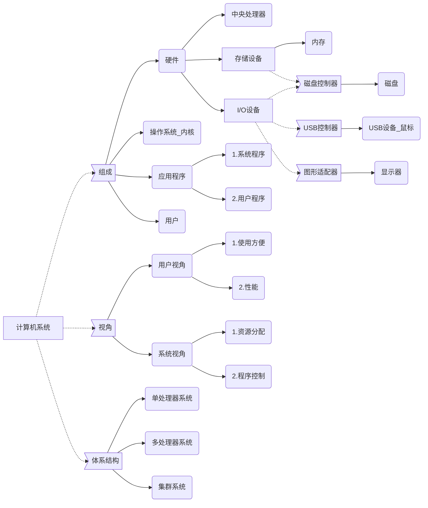

# 01_操作系统小结

## 一、操作系统概述

```mermaid
graph LR
main[计算机系统] -.-> component>组成]
component --> hardware(硬件)
component --> os(操作系统_内核)
component --> app(应用程序)
component --> user(用户)

hardware --> cpu(中央处理器)
hardware --> storage[存储设备]
storage --> memory(内存)
storage -.-> disk_ctrl>磁盘控制器]
disk_ctrl --> disk(磁盘)
hardware --> io_dev[I/O设备]
io_dev -.-> disk_ctrl
io_dev -.-> usb_ctrl>USB控制器]
usb_ctrl --> usb_dev(USB设备_鼠标)
io_dev -.-> graph_adapter>图形适配器]
graph_adapter --> screen(显示器)

main -.-> view>视角]
view --> user_view(用户视角)
user_view --> convenience(1.使用方便)
user_view --> performance(2.性能)
view --> sys_view(系统视角)
sys_view --> res_allocate(1.资源分配)
sys_view --> prog_control(2.程序控制)

app --> sys_app(1.系统程序)
app --> user_app(2.用户程序)

main -.-> architecture>体系结构]
architecture --> single_cpu(单处理器系统)
architecture --> multi_cpu(多处理器系统)
architecture --> cluster(集群系统)
```

